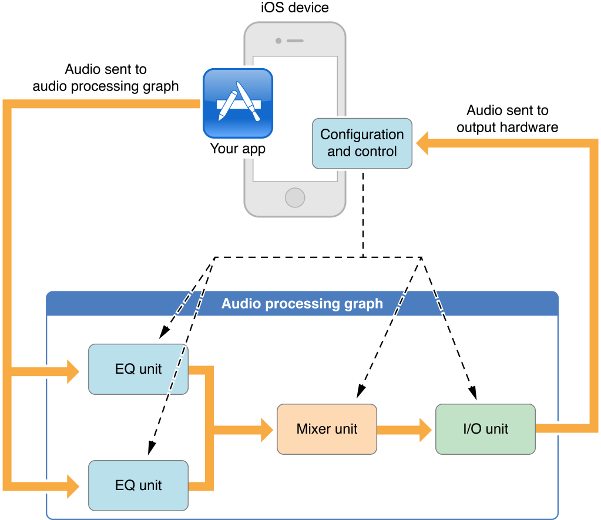

iOS提供音频处理插件，支持混合、均衡、格式转换和实时输入/输出，用于录音、回放、离线渲染和实时对话，如VoIP (Voice over Internet Protocol)。您可以动态地从iOS应用程序中加载和使用(即托管)这些强大而灵活的插件，即*audio units*。

Audio units 通常在一个称为音频处理图（*audio processing graph*）的封闭对象上下文中工作，如图所示。在这个例子中，你的app通过一个或多个回调函数将音频发送到图中的第一个音频单元，并对每个音频单元进行单独控制。I/O unit 的输出（这个或任何音频处理图中的最后一个音频单元）直接连接到输出硬件。

因为 audio units 是 iOS音频编程堆栈的最底层，所以比起其他iOS音频技术，你需要更深入地理解它们。

除非你需要实时播放合成的声音，低延迟的I/O(输入和输出)，或特定的音频单元功能，否则首先考虑的应该是 Media Player, AV Foundation, OpenAL, 或者 Audio Toolbox frameworks这些技术。这些更高层次的技术可以代替您使用音频单元，并提供重要的附加功能，如 *[Multimedia Programming Guide](https://developer.apple.com/library/archive/documentation/AudioVideo/Conceptual/MultimediaPG/Introduction/Introduction.html#//apple_ref/doc/uid/TP40009767)* 所述

### Audio Units Provide Fast, Modular Audio Processing（音频单元提供快速，模块化音频处理）

直接使用音频单元的两个最大优势是:

- 优秀的响应能力。因为你可以访问音频单元渲染回调函数中的实时优先级线程，所以你的音频代码尽可能接近金属。合成乐器和实时同步语音I/O从直接使用音频单元中获益最多。
- 动态重新配置。音频处理图形API是围绕 [AUGraph](https://developer.apple.com/documentation/audiotoolbox/augraph) 不透明类型构建的，它允许你在处理音频的同时，以线程安全的方式动态地组装、重新配置和重新安排复杂的音频处理链。这是iOS中唯一提供此功能的音频API。

音频单元的生命周期如下:

1. 在运行时，获取一个动态可链接库的引用，该库定义了您想要使用的音频单元
2. 实例化音频单元
3. 根据所需的类型配置音频单元，满足你的需求
4. 初始化音频单元，使其准备好处理音频
5. 开始音频流
6. 控制音频单元
7. 完成后，释放音频单元

音频单元提供了非常有用的个人功能，如立体声平移、混合、音量控制和音频电平测量。托管音频单元可以让你将这些功能添加到你的应用程序中。然而，为了获得这些好处，你必须了解一些基本概念，包括音频数据流格式、渲染回调函数和音频单元架构。

> 相关章节：[Audio Unit Hosting Fundamentals](https://developer.apple.com/library/archive/documentation/MusicAudio/Conceptual/AudioUnitHostingGuide_iOS/AudioUnitHostingFundamentals/AudioUnitHostingFundamentals.html#//apple_ref/doc/uid/TP40009492-CH3-SW11)

### Choosing a Design Pattern and Constructing Your App（选择一个设计模式并构建你的应用）

音频单元托管设计模式提供了一个灵活的蓝图来定制应用的细节。每个模式都表示:

- 如何配置I/O单元。I/O单元有两个独立的元素，一个从输入硬件接收音频，一个将音频发送到输出硬件。每个设计模式都指示应该启用哪个或哪些元素。
- 其中，在音频处理图中，必须指定音频数据流格式。您必须正确指定支持音频流的格式。
- 在哪里建立音频单元连接以及在哪里添加渲染回调函数。音频单元连接是一种正式的构造，它将流格式从一个音频单元的输出传播到另一个音频单元的输入。回调允许您将音频输入到 graph 中，或在 graph 中的单个示例级别上操作音频

无论你选择哪种设计模式，构建音频单元托管应用的步骤基本上是相同的:

1. 配置应用程序音频会话，以确保应用程序在系统和设备硬件环境下正确工作
2. 构造一个音频处理图（audio processing graph）。这个多步骤的过程利用了你在音频单元托管基础中学到的一切
3. 提供一个用户界面来控制图形的音频单元

熟悉这些步骤，以便将它们应用到您自己的项目中。

> 相关章节： [Constructing Audio Unit Apps](https://developer.apple.com/library/archive/documentation/MusicAudio/Conceptual/AudioUnitHostingGuide_iOS/ConstructingAudioUnitApps/ConstructingAudioUnitApps.html#//apple_ref/doc/uid/TP40009492-CH16-SW1)

### Get the Most Out of Each Audio Unit（充分利用每个音频单元）

本文的大部分内容将告诉你所有iOS音频单元都具有重要的共同属性。例如，你的应用程序需要在运行时指定和加载音频单元，然后正确地指定它的音频流格式。

同时，每个音频单元都有某些独特的功能和要求，从要使用的正确音频样本数据类型到正确行为所需的配置。了解每个音频单元的使用细节和具体功能，这样你就知道，例如，何时使用3D Mixer单元，何时使用Multichannel Mixer。

> 相关章节：[Using Specific Audio Units](https://developer.apple.com/library/archive/documentation/MusicAudio/Conceptual/AudioUnitHostingGuide_iOS/UsingSpecificAudioUnits/UsingSpecificAudioUnits.html#//apple_ref/doc/uid/TP40009492-CH17-SW1)

## How to Use This Document

如果你想在开始你的项目之前有一个坚实的概念基础，请先阅读  [Audio Unit Hosting Fundamentals](https://developer.apple.com/library/archive/documentation/MusicAudio/Conceptual/AudioUnitHostingGuide_iOS/AudioUnitHostingFundamentals/AudioUnitHostingFundamentals.html#//apple_ref/doc/uid/TP40009492-CH3-SW11)。本章解释api背后的概念。继续阅读 [Constructing Audio Unit Apps](https://developer.apple.com/library/archive/documentation/MusicAudio/Conceptual/AudioUnitHostingGuide_iOS/ConstructingAudioUnitApps/ConstructingAudioUnitApps.html#//apple_ref/doc/uid/TP40009492-CH16-SW1)，学习如何为你的项目选择设计模式和构建应用程序的工作流。

如果你有一些音频单元的经验，只是想要特定类型的细节，你可以从  [Using Specific Audio Units](https://developer.apple.com/library/archive/documentation/MusicAudio/Conceptual/AudioUnitHostingGuide_iOS/UsingSpecificAudioUnits/UsingSpecificAudioUnits.html#//apple_ref/doc/uid/TP40009492-CH17-SW1) 开始

基本参考文档包括以下内容:

- *[Audio Unit Properties Reference](https://developer.apple.com/documentation/audiounit/audio_unit_properties)* 描述可用于配置每种音频单元类型的属性

- *[Audio Unit Parameters Reference](https://developer.apple.com/documentation/audiounit/audio_unit_parameters)* 描述可用于控制每种音频单元类型的参数。
- *[Audio Unit Component Services Reference](https://developer.apple.com/documentation/audiounit/audio_unit_component_services)* 描述用于访问音频单元参数和属性的API，并描述各种音频单元回调函数。
- *[Audio Component Services Reference](https://developer.apple.com/documentation/audiounit/audio_component_services)* 描述了在运行时访问音频单元和管理音频单元实例的API。
- *[Audio Unit Processing Graph Services Reference](https://developer.apple.com/documentation/audiotoolbox/audio_unit_processing_graph_services)* 描述用于构造和操作音频处理图的API，这些图是动态可重构的音频处理链。
- *[Core Audio Data Types Reference](https://developer.apple.com/documentation/coreaudio/core_audio_data_types)* 描述托管音频单元所需的数据结构和类型。

