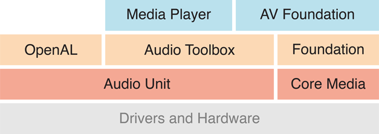
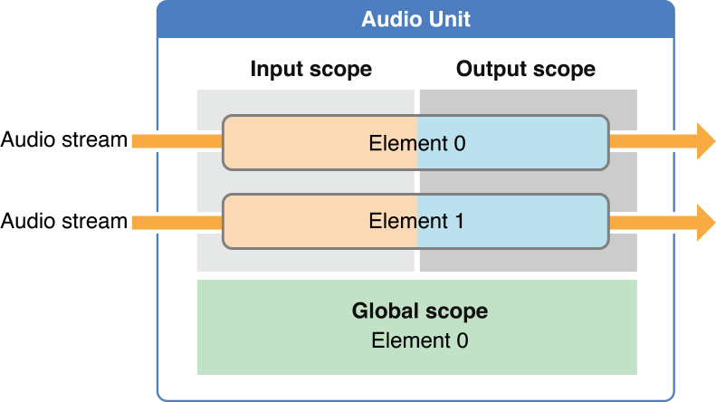
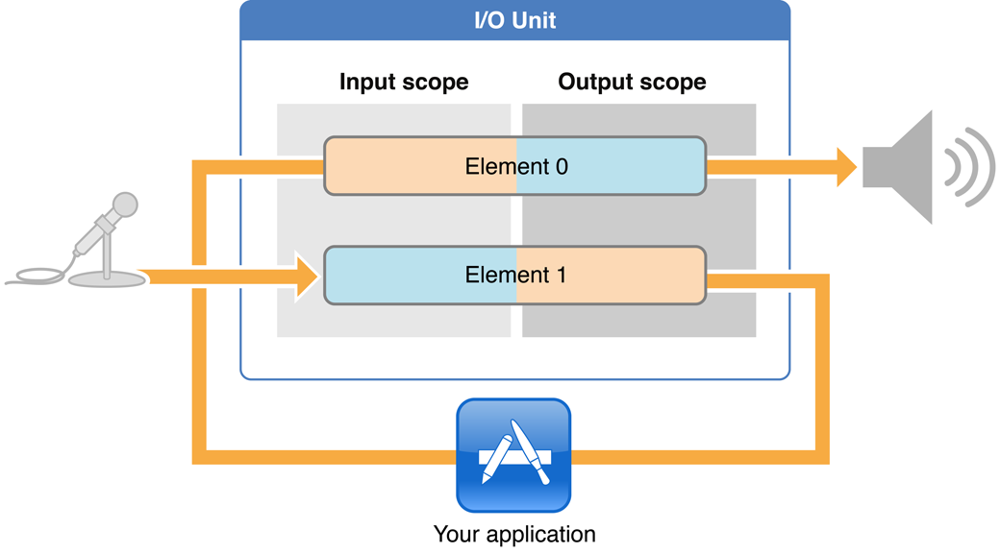
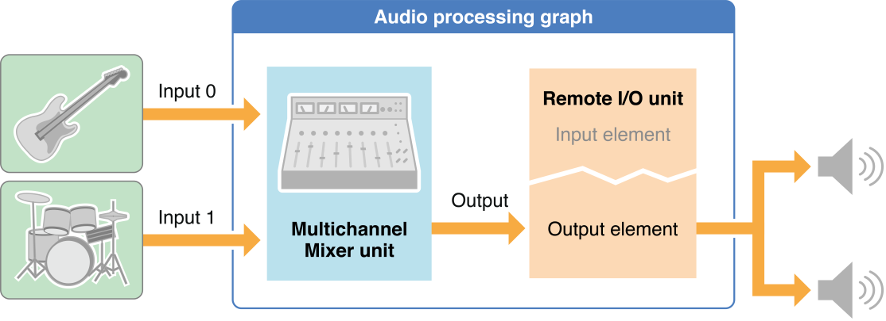
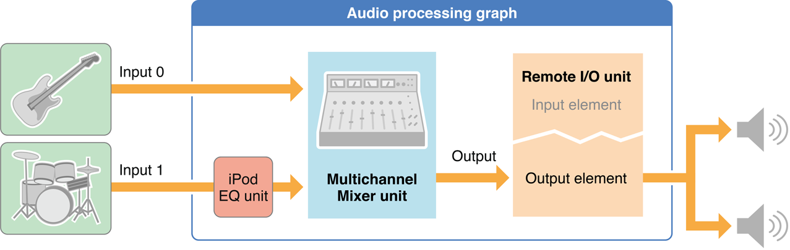
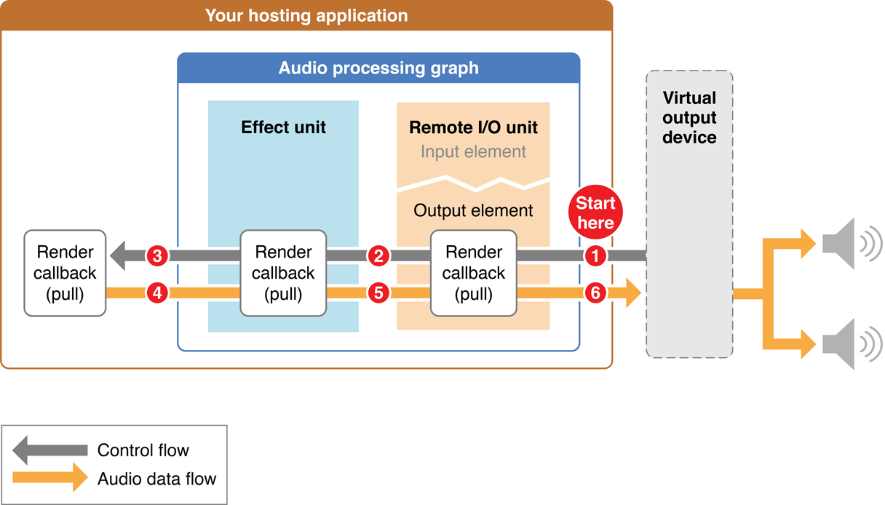
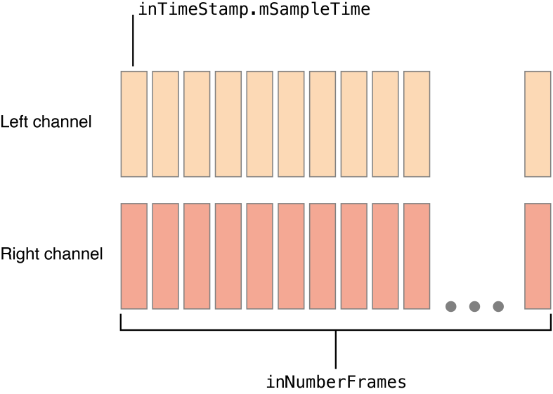
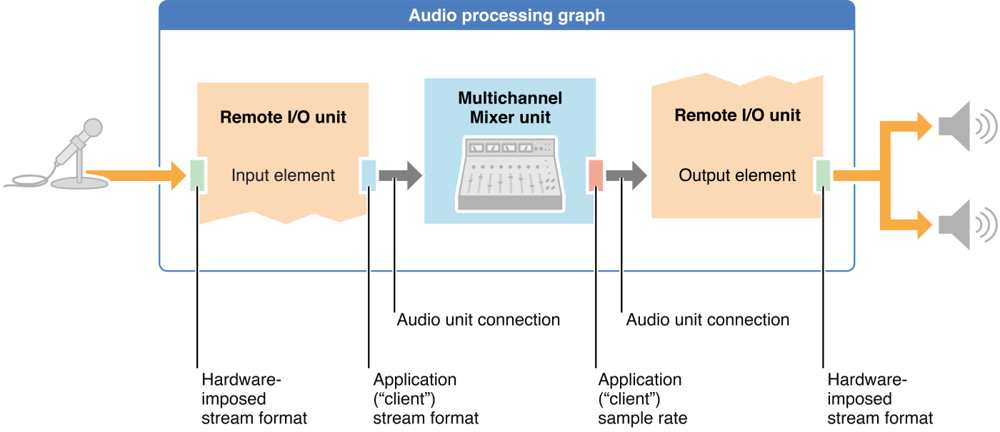

iOS中的所有音频技术都建立在音频单元之上，如图所示。这里展示的高级技术 Media Player, AV Foundation, OpenAL, 和 Audio Toolbox 都是包装的音频单元，为特定任务提供专用的api



在项目中只有当你需要最高程度的控制、性能或灵活性时，或者当你需要一个只有直接使用音频单元才能获得的特定功能 (如回声消除) 时，直接使用音频单元才是正确的选择，否则请选用其他api


## Audio Units Provide Fast, Modular Audio Processing（音频单元提供快速，模块化音频处理）

当你需要以下内容之一时，直接使用音频单元，而不是通过更高层次的api:

- 低延迟的同步音频I/O(输入和输出)，如VoIP (Voice over Internet Protocol)应用程序
- 对合成声音的响应式播放，如音乐游戏或合成乐器
- 使用一种特定的音频单元功能，如回声消除、混音或音调均衡
- 一个处理链架构，让您将音频处理模块组装到灵活的网络中。这是iOS中唯一提供此功能的音频API。

### Audio Units in iOS

iOS提供7个音频单元，按用途分为4类

| Purpose             | Audio units                                          |
| :------------------ | :--------------------------------------------------- |
| *Effect*            | iPod Equalizer                                       |
| *Mixing*            | 3D Mixer<br>Multichannel Mixer                       |
| *I/O*               | Remote I/O<br>Voice-Processing I/O<br>Generic Output |
| *Format conversion* | Format Converter                                     |

> 注意:iOS动态插件架构不支持第三方音频单元。也就是说，唯一可用于动态加载的音频单元是由操作系统提供的。

#### 1. Effect Unit

iOS 4提供了一个效果单元，iPod均衡器，相同的均衡器使用内置的iPod应用程序。要查看iPod应用程序的用户界面为这个音频单元，去设置> iPod > EQ。当使用这个音频单元，你必须提供自己的UI。这个音频单元提供了一套预设的均衡曲线，如低音助推器，流行，和口头的词。

#### 2. Mixer Units

iOS提供了两个混合器单元。3D Mixer单元是OpenAL建立的基础。在大多数情况下，如果你需要3D Mixer单元的功能，你最好的选择是使用OpenAL，它提供了一个更高级的API，非常适合游戏应用程序。

多通道混频器单元提供任何数量的单声道或立体声流的混合，与立体声输出。您可以打开或关闭每个输入，设置其输入增益，并设置其立体声平移位置。有关如何使用此音频单元的演示，请参见示例代码项目audio Mixer (MixerHost)。

#### 3. I/O Units

iOS提供3个I/O单元。Remote I/O 单元是最常用的。它连接到输入和输出音频硬件，为您提供低延迟访问单个传入和传出音频样本值。它提供了硬件音频格式和应用程序音频格式之间的格式转换，通过包含的格式转换器单元来实现

*Voice-Processing I/O*单元通过添加用于VoIP或语音聊天应用程序的回声消除来扩展远程I/O单元。它还提供自动增益校正，语音处理质量的调整和静音。

Generic Output单元不连接音频硬件，而是提供了一种将处理链的输出发送到应用程序的机制。您通常会使用Generic Output单元进行离线音频处理。

#### 4. Format Converter Unit

iOS 4提供了一个格式转换器单元，通常通过I/O单元间接使用。


### Use the Two Audio Unit APIs in Concert（同时使用两个音频单元api）

iOS有一个用于直接处理 audio units 的API，还有另一个用于处理 audio processing graphs。当你在应用中使用音频单元时，你会同时使用这两个api。

- 要直接使用 audio units (配置和控制它们)，请使用  *[Audio Unit Component Services Reference](https://developer.apple.com/documentation/audiounit/audio_unit_component_services)* 中描述的方法
- 要创建和配置 audio processing graph (音频单元的处理链)，请使用 *[Audio Unit Processing Graph Services Reference](https://developer.apple.com/documentation/audiotoolbox/audio_unit_processing_graph_services)* 中描述的方法

这两个api之间有一些重叠，您可以根据自己的编程风格自由混合和匹配。audio unit API 和 audio processing graph API 分别提供以下功能：

- 获取对定义音频单元的动态链接库的引用
- 实例化音频单元
- 连接音频单元和附加渲染回调函数
- 启动和停止音频流

本文档提供了使用这两种API的代码示例，但重点关注 audio processing graph API。如果需要在代码中的两个API之间进行选择，请使用graph API，除非您有特定的理由不这样做。你的代码会更紧凑，更容易阅读，更易于支持动态重新配置 (见  [Audio Processing Graphs Provide Thread Safety](https://developer.apple.com/library/archive/documentation/MusicAudio/Conceptual/AudioUnitHostingGuide_iOS/AudioUnitHostingFundamentals/AudioUnitHostingFundamentals.html#//apple_ref/doc/uid/TP40009492-CH3-SW5) )


### Use Identifiers to Specify and Obtain Audio Units（使用标识符来指定和获取音频单元）

要在运行时找到音频单元，首先在音频组件描述数据结构中指定其 type、subtype 和 manufacturer keys。无论使用audio unit 还是 audio processing graph API，都要做到这一点

**Listing 1-1** Creating an audio component description to identify an audio unit

``` c
AudioComponentDescription ioUnitDescription;
 
ioUnitDescription.componentType          = kAudioUnitType_Output;
ioUnitDescription.componentSubType       = kAudioUnitSubType_RemoteIO;
ioUnitDescription.componentManufacturer  = kAudioUnitManufacturer_Apple;
ioUnitDescription.componentFlags         = 0;
ioUnitDescription.componentFlagsMask     = 0;
```

这个描述精确地指定了一个音频单元—Remote I/O unit。这个key和iOS中其他音频单元key都列在 [Identifier Keys for Audio Units](https://developer.apple.com/library/archive/documentation/MusicAudio/Conceptual/AudioUnitHostingGuide_iOS/UsingSpecificAudioUnits/UsingSpecificAudioUnits.html#//apple_ref/doc/uid/TP40009492-CH17-SW14) 中。注意，所有iOS音频单元在componentManufacturer字段中都使用  [kAudioUnitManufacturer_Apple](https://developer.apple.com/documentation/audiotoolbox/1584143-audio_unit_manufacturer_identifi/kaudiounitmanufacturer_apple)。

要创建通配符描述，请将一个或多个 type / subtype 字段设置为0。例如，要匹配所有I/O单元，将设置 componentSubType = 0

有了描述之后，您可以使用两个api中的任意一个来获得指定音频单元(或音频单元集)的库引用。音频单元API如下所示

**Listing 1-2** Obtaining an audio unit instance using the audio unit API

``` c
AudioComponent foundIoUnitReference = AudioComponentFindNext (
                                          NULL,
                                          &ioUnitDescription
                                      );
AudioUnit ioUnitInstance;
AudioComponentInstanceNew (
    foundIoUnitReference,
    &ioUnitInstance
);
```

- 将 NULL 传递给 AudioComponentFindNext 的第一个参数，告诉该函数使用系统定义的顺序找到匹配描述的第一个系统音频单元。如果在此参数中传递先前找到的音频单元引用，该函数将定位与描述匹配的下一个音频单元。例如，这种用法允许您通过反复调用 AudioComponentFindNext 来获得对所有I/O单元的引用

- AudioComponentFindNext 调用的第二个参数引用清单1-1中定义的音频单元描述。

- AudioComponentFindNext 函数的结果是对定义音频单元的动态可链接库的引用。将引用传递给 [AudioComponentInstanceNew](https://developer.apple.com/documentation/audiotoolbox/1410465-audiocomponentinstancenew) 函数来实例化音频单元，如清单1-2所示。

你可以使用 audio processing graph API 来实例化音频单元。清单1-3显示了如何做到这一点

**Listing 1-3** Obtaining an audio unit instance using the audio processing graph API

``` c
// Declare and instantiate an audio processing graph
AUGraph processingGraph;
NewAUGraph (&processingGraph);
 
// Add an audio unit node to the graph, then instantiate the audio unit
AUNode ioNode;
AUGraphAddNode (
    processingGraph,
    &ioUnitDescription,
    &ioNode
);
AUGraphOpen (processingGraph); // indirectly performs audio unit instantiation
 
// Obtain a reference to the newly-instantiated I/O unit
AudioUnit ioUnit;
AUGraphNodeInfo (
    processingGraph,
    ioNode,
    NULL,
    &ioUnit
);
```

此代码清单介绍了 [AUNode](https://developer.apple.com/documentation/audiotoolbox/aunode)，这是一种不透明的类型，表示 audio processing graph 上下文中的音频单元。在 [AUGraphNodeInfo](https://developer.apple.com/documentation/audiotoolbox/1502407-augraphnodeinfo) 函数调用的输出中，您在 ioUnit 参数中接收到对新的音频单元实例的引用

[AUGraphAddNode](https://developer.apple.com/documentation/audiotoolbox/1501671-augraphaddnode) 调用的第二个参数引用清单1-1中定义的音频单元描述。

获得音频单元实例后，可以对其进行配置。为此，您需要了解两个音频单元的特性，*scopes* 和 *elements*


### Use Scopes and Elements to Specify Parts of Audio Units（使用 Scopes 和 Elements 来指定音频单元的部分）

一个音频单元的各个部分被组织成 scopes 和 elements，如图1-2所示。当调用一个函数来配置或控制一个音频单元时，您可以指定 scopes 和 elements 来标识该函数的特定目标。

**Figure 1-2** Audio unit scopes and elements



scope 是音频单元中的编程上下文。尽管 *global scope*  的名称可能暗示了其他情况，但这些上下文从来不是嵌套的。通过使用 `Audio Unit Scopes` 枚举中的常量来指定目标scope。

element 是嵌套在 audio unit scope 内的编程上下文。当一个 element 是输入或输出 scope 的一部分时，它类似于物理音频设备中的信号总线—因此有时称为 bus。这两个术语—*element* 和 *bus*—在音频单元编程中指的是完全相同的东西。本文档在强调信号流时使用 bus，在强调音频单元的特定功能方面使用 elements，如I/O单元的输入和输出 elements (见  [Essential Characteristics of I/O Units](https://developer.apple.com/library/archive/documentation/MusicAudio/Conceptual/AudioUnitHostingGuide_iOS/AudioUnitHostingFundamentals/AudioUnitHostingFundamentals.html#//apple_ref/doc/uid/TP40009492-CH3-SW43))

可以通过 zero-indexed 整数值指定 element (或 bus)。如果设置一个应用于整个 scope 的属性或参数，则将 element 值指定为0。

上图1-2说明了音频单元的一种常见架构，其中输入和输出的 elements 数量是相同的。然而，不同的音频单元使用不同的架构。例如，一个混频器单元可能有几个输入 elements ，但只有一个输出 elements 。您可以将在这里学到的关于 scope 和 elements 的知识扩展到任何音频单元，尽管架构中存在一些变化

global scope，如图1-2的底部所示，应用于作为一个整体的音频单元，而不与任何特定的音频流相关联。它只有一个 element，即 element 0。有些属性，比如每个片的最大帧数(kAudioUnitProperty_MaximumFramesPerSlice)，只应用于 global scope。

输入和输出 scopes 直接参与通过音频单元移动一个或多个音频流。如您所料，音频从输入 scope 进入，从输出 scope 离开。属性或参数可以作为一个整体应用于输入或输出 scope，例如 element 计数属性 (kAudioUnitProperty_ElementCount)。其他属性和参数，如启用I/O属性(kAudioOutputUnitProperty_EnableIO)或卷参数(kMultiChannelMixerParam_Volume)，应用于范围内的特定 element 


### Use Properties to Configure Audio Units（使用属性配置音频单元）

音频单元 property 是一个 key-value 键值对，可以用来配置音频单元。属性的键是具有相关助记符标识符的唯一整数，例如 `kAudioUnitProperty_MaximumFramesPerSlice = 14`。Apple保留从0到63999的属性键。在Mac OS X中，第三方音频单元使用这个范围以上的key

每个属性的值都是指定的数据类型，并具有指定的读/写访问权限，如  *[Audio Unit Properties Reference](https://developer.apple.com/documentation/audiounit/audio_unit_properties)* 中所述。要在任何音频单元上设置任何属性，可以使用一个灵活的函数: [AudioUnitSetProperty](https://developer.apple.com/documentation/audiotoolbox/1440371-audiounitsetproperty)。清单1-4显示了该函数的典型用法，注释突出显示了如何指定 scope 和 element，以及指示属性的键和值。

**Listing 1-4** Using scope and element when setting a property

``` c
UInt32 busCount = 2;
 
OSStatus result = AudioUnitSetProperty (
    mixerUnit,
    kAudioUnitProperty_ElementCount,   // the property key
    kAudioUnitScope_Input,             // the scope to set the property on
    0,                                 // the element to set the property on
    &busCount,                         // the property value
    sizeof (busCount)
);
```

以下是你在音频单元开发中会经常用到的一些属性。通过阅读它的参考文档来熟悉它们:

- [kAudioOutputUnitProperty_EnableIO](https://developer.apple.com/documentation/audiotoolbox/1534116-i_o_audio_unit_properties/kaudiooutputunitproperty_enableio), 用于启用或禁用I/O输入或输出。默认情况下，输出是启用的，输入是禁用的。
- [kAudioUnitProperty_ElementCount](https://developer.apple.com/documentation/audiotoolbox/1534199-generic_audio_unit_properties/kaudiounitproperty_elementcount), 例如，用于配置 mixer unit 上的输入 elements 数量
- [kAudioUnitProperty_MaximumFramesPerSlice](https://developer.apple.com/documentation/audiotoolbox/1534199-generic_audio_unit_properties/kaudiounitproperty_maximumframesperslice)，为了指定音频数据的最大帧数，音频单元应准备用于响应渲染调用而产生。对于大多数音频单元，在大多数情况下，您必须按照参考文档中描述的那样设置此属性。如果你不这样做，你的音频将在屏幕锁定时停止
- [kAudioUnitProperty_StreamFormat](https://developer.apple.com/documentation/audiotoolbox/kaudiounitproperty_streamformat)，用于指定特定音频单元输入或输出 bus 的音频流数据格式

大多数属性值只能在音频单元未初始化时设置。用户不打算更改这些属性。但是，有些，比如iPod EQ单元的 [kAudioUnitProperty_PresentPreset](https://developer.apple.com/documentation/audiotoolbox/kaudiounitproperty_presentpreset) 属性，以及 Voice-Processing I/O 单元的 [kAUVoiceIOProperty_MuteOutput](https://developer.apple.com/documentation/audiotoolbox/kauvoiceioproperty_muteoutput) 属性，是打算在播放音频时更改的

要发现属性的可用性，访问其值，并监视其值的更改，可以使用以下函数:

- [AudioUnitGetPropertyInfo](https://developer.apple.com/documentation/audiotoolbox/1440663-audiounitgetpropertyinfo)，查明某属性是否可用; 如果是，则给出其值的数据大小以及是否可以更改该值
- [AudioUnitGetProperty](https://developer.apple.com/documentation/audiotoolbox/1439840-audiounitgetproperty)， [AudioUnitSetProperty](https://developer.apple.com/documentation/audiotoolbox/1440371-audiounitsetproperty)，获取或设置属性的值
- [AudioUnitAddPropertyListener](https://developer.apple.com/documentation/audiotoolbox/1440111-audiounitaddpropertylistener)，[AudioUnitRemovePropertyListenerWithUserData](https://developer.apple.com/documentation/audiotoolbox/1441010-audiounitremovepropertylistenerw)，安装或移除回调函数以监视对属性值的更改


### Use Parameters and UIKit to Give Users Control

音频单元参数用户是可配置的，当音频单元产生音频时，该设置可以改变。事实上，大多数参数(如音量或立体声平移位置)的目的是实时调整音频单元正在执行的处理。

与音频单元属性一样，音频单元参数也是键值对。key是由它所适用的音频单元定义的。它总是一个枚举常量，例如 `kMultiChannelMixerParam_Pan = 2`，它对音频单元是唯一的，但不是全局唯一的。

与属性值不同，每个参数值都具有相同的类型: 32位浮点数。一个值的允许范围，以及它所代表的度量单位，是由参数的音频单元的实现确定的。这些和其他方面的参数在 *[Audio Unit Parameters Reference](https://developer.apple.com/documentation/audiounit/audio_unit_parameters)*

要获取或设置参数值，请使用以下函数之一，音频单元组件服务参考中详细描述了这些函数:

- [AudioUnitGetProperty](https://developer.apple.com/documentation/audiotoolbox/1440055-audiounitgetparameter)
- [AudioUnitSetProperty](https://developer.apple.com/documentation/audiotoolbox/1440371-audiounitsetproperty)

为了让用户控制一个音频单元，让他们通过用户界面访问它的参数。首先从UIKit框架中选择一个合适的类来表示参数。对于一个 on/off 特性，例如 Multichannel Mixer单元的kMultiChannelMixerParam_Enable 参数，你可以使用一个UISwitch对象。对于一个持续变化的特征，比如由 kMultiChannelMixerParam_Pan 参数提供的立体平移位置，你可以使用UISlider对象


### Essential Characteristics of I/O Units（I/O单元的基本特征）

一个I/O单元包含两个 elements，如图1-3所示。

**Figure 1-3** The architecture of an I/O unit



尽管这两个 elements 是一个音频单元的一部分，但你的应用将它们视为独立的实体。例如，您可以根据应用程序的需要使用enable I/O属性 ([kAudioOutputUnitProperty_EnableIO](https://developer.apple.com/documentation/audiotoolbox/1534116-i_o_audio_unit_properties/kaudiooutputunitproperty_enableio)) 来独立地启用或禁用每个element。

I/O单元的 `Element 1` 直接连接到设备上的音频输入硬件，在图中由麦克风表示。这个硬件连接 ( element 1 的 Input scope ) 对您来说是不透明的。对从输入硬件输入的音频数据的第一次访问是在 element 1 的 Output scope 内。

类似地，I/O单元的 element 0 直接连接设备上的音频输出硬件，如图1-3所示，由扬声器表示。您可以将音频传递到 element 0 的 Input scope，但其 Output scope 是不透明的。

在处理音频单元时，你经常会听到I/O单元的两个 elements 不是通过数字而是通过名称来描述:

- Input element 是 element 1 ( input 中的字母 i 的外观与数字1相似)

- Output element 是 element 0 ( 单词 output 的字母 O 的外观类似于数字0)

如图1-3所示，每个 element 本身都有一个 Input scope 和一个 Output scope 。出于这个原因，描述I/O单元的这些部分可能会有点混乱。例如，您可以说，在一个同步I/O应用程序中，您从 Input element 的 Output scope 接收音频，并将音频发送到 Output element 的 Input scope

最后，I/O单元是 audio processing graph 中唯一能够启动和停止音频流的音频单元。通过这种方式，I/O单元负责音频单元应用程序中的音频流


## Audio Processing Graphs Manage Audio Units

*audio processing graph* 是一种 Core Foundation风格的不透明类型，[AUGraph](https://developer.apple.com/documentation/audiotoolbox/augraph)，您可以使用它来构建和管理音频单元处理链。graph 可以利用多个音频单元和多个渲染回调函数的功能，允许您创建几乎任何您能想到的音频处理解决方案

AUGraph 类型为音频单元添加了线程安全性: 它允许你动态地重新配置处理链。例如，当音频正在播放时，您可以安全地插入一个均衡器，或者甚至为一个混音输入交换一个不同的渲染回调函数。实际上，AUGraph类型提供了iOS中唯一用于在音频应用中执行这种动态重新配置的API。

 audio processing graph API 使用另一种不透明的类型  [AUNode](https://developer.apple.com/documentation/audiotoolbox/aunode) 来表示 graph 上下文中的单个音频单元。当使用 graph 时，您通常将 nodes 作为其包含的音频单元的代理与它们交互，而不是直接与音频单元交互

然而，当将 graph 组合在一起时，你必须配置每个音频单元，为此你必须通过 audio unit API 直接与音频单元交互。音频单元节点本身是不可配置的。通过这种方式，构造一个 graph 需要您使用这两个api，如在  [Use the Two Audio Unit APIs in Concert](https://developer.apple.com/library/archive/documentation/MusicAudio/Conceptual/AudioUnitHostingGuide_iOS/AudioUnitHostingFundamentals/AudioUnitHostingFundamentals.html#//apple_ref/doc/uid/TP40009492-CH3-SW42) 中所解释的那样

您还可以通过定义node来表示完整的音频处理 subgraph，将 AUNode 实例作为复杂graph中的element使用。在这种情况下， subgraph 末尾的I/O单元必须是Generic Output单元—不连接设备硬件的I/O单元的一种类型。

大体来说，构建 audio processing graph 需要三个任务:

- 向 graph 添加 nodes
- 直接配置由 nodes 表示的音频单元
- 连接 nodes

有关这些任务和 audio processing graph 生命周期其余部分的详细信息，参考[Constructing Audio Unit Apps](https://developer.apple.com/library/archive/documentation/MusicAudio/Conceptual/AudioUnitHostingGuide_iOS/ConstructingAudioUnitApps/ConstructingAudioUnitApps.html#//apple_ref/doc/uid/TP40009492-CH16-SW1)。有关API的完整描述，请参阅  *[Audio Unit Processing Graph Services Reference](https://developer.apple.com/documentation/audiotoolbox/audio_unit_processing_graph_services)*


### An Audio Processing Graph Has Exactly One I/O Unit（一个音频处理图有一个I/O单元）

每个 audio processing graph 都有一个I/O单元，无论您是在进行录音、播放还是同时I/O。I/O单元可以是iOS中可用的任意一种，这取决于你的应用程序的需求。关于I/O单元如何在各种使用场景中适合 audio processing graph 的架构，请参见  [Start by Choosing a Design Pattern](https://developer.apple.com/library/archive/documentation/MusicAudio/Conceptual/AudioUnitHostingGuide_iOS/ConstructingAudioUnitApps/ConstructingAudioUnitApps.html#//apple_ref/doc/uid/TP40009492-CH16-SW2)

Graphs 让你通过  [AUGraphStart](https://developer.apple.com/documentation/audiotoolbox/1502297-augraphstart) 和 [AUGraphStop](https://developer.apple.com/documentation/audiotoolbox/1503233-augraphstop) 函数来启动和停止音频流。这些函数依次通过调用其 [AudioOutputUnitStart](https://developer.apple.com/documentation/audiotoolbox/1439763-audiooutputunitstart) 或 [AudioOutputUnitStop](https://developer.apple.com/documentation/audiotoolbox/1440513-audiooutputunitstop) 函数向I/O单元传递启动或停止消息。这样，graph 的I/O单元负责 graph 中的音频流


### Audio Processing Graphs Provide Thread Safety（音频处理图形提供线程安全性）

audio processing graph API 采用了 ”to-do list“ 的隐喻来提供线程安全性。此API中的某些函数将一个工作单元添加到更改列表中，以便稍后执行。在您指定了一组完整的更改之后，您可以要求 graph 来实现它们。

以下是 audio processing graph API 支持的一些常见的重新配置，以及它们的相关功能:

- 添加 或 删除 音频单元 nodes ( [AUGraphAddNode](https://developer.apple.com/documentation/audiotoolbox/1501671-augraphaddnode),  [AUGraphRemoveNode](https://developer.apple.com/documentation/audiotoolbox/1502439-augraphremovenode) )
- 添加 或 删除 nodes 之间的连接 ( [AUGraphConnectNodeInput](https://developer.apple.com/documentation/audiotoolbox/1502636-augraphconnectnodeinput), [AUGraphDisconnectNodeInput](https://developer.apple.com/documentation/audiotoolbox/1502008-augraphdisconnectnodeinput))
- 连接渲染回调函数到音频单元的输入bus ( [AUGraphDisconnectNodeInput](https://developer.apple.com/documentation/audiotoolbox/1502008-augraphdisconnectnodeinput) )

让我们来看一个重新配置正在运行的 audio processing graph 的示例。例如，您已经构建了一个包含Multichannel Mixer单元和Remote I/O单元的 graph，用于两个合成声音的混合回放。您将声音输入mixer的两个输入bus。mixer 输出转到 I/O单元的输出 element，然后转到输出音频硬件。该架构如图1-4所示。

**Figure 1-4** A simple audio processing graph for playback



现在，假设用户想将均衡器插入到两个音频流中的其中一个。要做到这一点，在其中一个声音的输入和它要进入的 mixer 输入之间添加iPod EQ单元，如图1-5。

**Figure 1-5** The same graph after inserting an equalizer



完成这个实时重新配置的步骤如下:

1. 通过调用 [AUGraphDisconnectNodeInput](https://developer.apple.com/documentation/audiotoolbox/1502008-augraphdisconnectnodeinput) 从 mixer 单元的 Input 1 断开 “beats sound” 回调
2. 将包含iPod EQ单元的音频单元node添加到graph中。通过使用 [AudioComponentDescription](https://developer.apple.com/documentation/audiotoolbox/audiocomponentdescription) 结构体指定iPod EQ单元，然后调用[AUGraphAddNode](https://developer.apple.com/documentation/audiotoolbox/1501671-augraphaddnode)来实现这一点。在这一点上，iPod EQ单元被实例化，但没有初始化。它属于 graph，但尚未参与音频流。
3. 配置和初始化iPod EQ单元。在这个例子中，这需要一些东西:
   - 调用 [AudioUnitGetProperty](https://developer.apple.com/documentation/audiotoolbox/1439840-audiounitgetproperty) 函数从 mixer 输入中检索流格式 ( [kAudioUnitProperty_StreamFormat](https://developer.apple.com/documentation/audiotoolbox/kaudiounitproperty_streamformat) )
   - 调用两次 [AudioUnitSetProperty](https://developer.apple.com/documentation/audiotoolbox/1440371-audiounitsetproperty) 函数，一次是在iPod EQ单元的输入上设置流格式，第二次是在输出上设置流格式。(有关如何配置iPod EQ单元的完整描述，请参见[Using Effect Units](https://developer.apple.com/library/archive/documentation/MusicAudio/Conceptual/AudioUnitHostingGuide_iOS/UsingSpecificAudioUnits/UsingSpecificAudioUnits.html#//apple_ref/doc/uid/TP40009492-CH17-SW4))
   - 调用 [AudioUnitInitialize](https://developer.apple.com/documentation/audiotoolbox/1439851-audiounitinitialize) 函数为iPod EQ单元分配资源，并准备它处理音频。这个函数调用不是线程安全的，但是当iPod EQ单元还没有积极参与音频处理图形(因为您还没有调用[AUGraphUpdate](https://developer.apple.com/documentation/audiotoolbox/1502855-augraphupdate)函数)时，您可以(而且必须)在这一点上执行它。
4. 通过调用[AUGraphSetNodeInputCallback](https://developer.apple.com/documentation/audiotoolbox/1501948-augraphsetnodeinputcallback)将“beats sound”回调函数附加到iPod EQ的输入。

在前面的列表中，步骤1、2和4——都是 `AUGraph*` 函数调用—被添加到图graph的 “to-do” 列表中。调用AUGraphUpdate来执行这些挂起的任务。在成功返回AUGraphUpdate 函数时，graph已被动态重新配置，iPod EQ已到位并处理音频。


### Audio Flows Through a Graph Using “Pull”（使用 ”pull“ 将音频流通过graph）

在 audio processing graph 中，消费者在需要更多音频数据时调用提供者。对音频数据的请求有一个流，这个流与音频流的方向相反。原理如图1-6所示。

**Figure 1-6** The pull mechanism of audio data flow



对一组数据的每个请求都称为呈现调用，或者，称为 pull。该图以灰色的“control flow”箭头表示渲染调用。渲染调用请求的数据更确切地说是一组音频样本帧 (参见 [frame](https://developer.apple.com/library/archive/documentation/MusicAudio/Reference/CoreAudioGlossary/Glossary/core_audio_glossary.html#//apple_ref/doc/uid/TP40004453-CH210-CHDHCAJI))

反过来，响应渲染调用而提供的一组音频样本帧被称为 slice。(参见 [slice](https://developer.apple.com/library/archive/documentation/MusicAudio/Reference/CoreAudioGlossary/Glossary/core_audio_glossary.html#//apple_ref/doc/uid/TP40004453-CH210-SW165) )。提供 slice 的代码被称为渲染回调函数，在[Render Callback Functions Feed Audio to Audio Units](https://developer.apple.com/library/archive/documentation/MusicAudio/Conceptual/AudioUnitHostingGuide_iOS/AudioUnitHostingFundamentals/AudioUnitHostingFundamentals.html#//apple_ref/doc/uid/TP40009492-CH3-SW27)中描述。

在图1-6中，pull 的过程如下:

1. 在您调用 [AUGraphStart](https://developer.apple.com/documentation/audiotoolbox/1502297-augraphstart) 函数之后，虚拟输出设备将调用 Remote I/O单元的 Output element 的回调。该调用请求处理过的音频数据帧的slice
2. Remote I/O单元的回调函数在其输入缓冲区中查找要处理的音频数据，以满足调用。如果有数据等待处理，Remote  I/O单元将使用它。否则，如图所示，它会调用应用连接到输入的回调函数。在这个例子中，Remote  I/O单元的输入连接到 effect单元 的输出。所以，I/O单元 pulls effect单元，请求slice音频帧。
3. effect单元的行为就像Remote I/O单元一样。当它需要音频数据时，它从输入连接中获取。在这个例子中，effect单元 pull 应用的渲染回调函数。
4. 你的应用程序的渲染回调函数是 pull 的最终接收者。它将请求的帧提供给effect单元。
5. effect单元 处理应用的渲染回调提供的slice。然后，effect单元将先前(在步骤2中)请求的已处理数据提供给 Remote I/O单元
6. Remote I/O单元处理由effect单元提供的slice。然后，Remote I/O单元将最初请求(在步骤1中)的已处理slice提供给虚拟输出设备。这完成了一个pull的循环


## Render Callback Functions Feed Audio to Audio Units（渲染回调函数提供音频到音频单元）

为了从磁盘或内存提供音频到音频单元输入bus，使用符合[AURenderCallback](https://developer.apple.com/documentation/audiotoolbox/aurendercallback)原型的渲染回调函数来传递它。当音频单元输入需要另一个样本帧slice时，它会调用你的回调函数，如在[Audio Flows Through a Graph Using Pull](https://developer.apple.com/library/archive/documentation/MusicAudio/Conceptual/AudioUnitHostingGuide_iOS/AudioUnitHostingFundamentals/AudioUnitHostingFundamentals.html#//apple_ref/doc/uid/TP40009492-CH3-SW7)中所述

编写回调函数的过程可能是设计和构建音频单元应用程序中最具创造性的方面。这是你以任何你能想象和编码的方式产生或改变声音的机会。

同时，渲染回调有一个必须遵守的严格性能要求。渲染回调存在于一个实时优先级线程上，后续的渲染回调将在该线程上异步到达。您在渲染回调中所做的事情是有时间限制的。如果当下一个回调到来时，你仍然在处理前一个渲染调用，那么你会在声音中得到一个间隙。因此，您不能在渲染回调函数中使用锁、分配内存、访问文件系统或网络连接，或以其他方式执行耗时的任务。


### Understanding the Audio Unit Render Callback Function（理解音频单元渲染回调函数）

清单1-5显示了符合 [AURenderCallback](https://developer.apple.com/documentation/audiotoolbox/aurendercallback) 原型的渲染回调函数的头。本节将依次介绍每个参数的用途和使用方法。

**Listing 1-5** A render callback function header

``` c
static OSStatus MyAURenderCallback (
    void                        *inRefCon,
    AudioUnitRenderActionFlags  *ioActionFlags,
    const AudioTimeStamp        *inTimeStamp,
    UInt32                      inBusNumber,
    UInt32                      inNumberFrames,
    AudioBufferList             *ioData
) { /* callback body */ }
```

- inRefCon 参数指向你在将回调附加到音频单元输入时指定的编程上下文 (参见[Write and Attach Render Callback Functions](https://developer.apple.com/library/archive/documentation/MusicAudio/Conceptual/AudioUnitHostingGuide_iOS/ConstructingAudioUnitApps/ConstructingAudioUnitApps.html#//apple_ref/doc/uid/TP40009492-CH16-SW13))。这个上下文的目的是为回调函数提供它需要的任何音频输入数据或状态信息，以计算给定渲染调用的输出音频

- ioActionFlags 参数允许回调当没有音频需要处理时为音频单元提供一个提示。例如，如果你的应用是一把合成吉他，而用户当前没有在弹奏某个音符，在回调函数体中使用如下语句:

  ``` c
  *ioActionFlags |= kAudioUnitRenderAction_OutputIsSilence;
  ```

- inBusNumber 参数表示调用回调的音频单元总线，允许您根据此值在回调中进行分支。此外，当附加回调到一个音频单元时，你可以为每个总线指定不同的上下文(inRefCon)。

- inNumberFrames 参数指示在当前调用中请求回调提供的音频样本帧的数量。你在ioData参数中提供这些帧给缓冲区

- ioData 参数指向在调用回调函数时必须填充的音频数据缓冲区。放入这些缓冲区的音频必须符合调用回调的总线的音频流格式。

  如果对回调的特定调用保持沉默，则显式地将这些缓冲区设置为0，例如使用memset函数。

图1-7在ioData参数中描述了一对非交错立体声缓冲区。使用图中的element来可视化回调需要填充的ioData缓冲区的细节

**Figure 1-7** The `ioData` buffers for a stereo render callback function




## Audio Stream Formats Enable Data Flow（音频流格式启用数据流）

在单个示例级别处理音频数据时，就像使用音频单元时一样，仅指定表示音频的正确数据类型是不够的。单个音频样本值中的位的布局是有意义的，所以像Float32或UInt16这样的数据类型表现力不够。在本节中，你将了解Core Audio的解决方案。

### Working with the AudioStreamBasicDescription structure（使用AudioStreamBasicDescription结构）

**Listing 1-6** The `AudioStreamBasicDescription` structure

``` c
struct AudioStreamBasicDescription {
    Float64 mSampleRate;
    UInt32  mFormatID;
    UInt32  mFormatFlags;
    UInt32  mBytesPerPacket;
    UInt32  mFramesPerPacket;
    UInt32  mBytesPerFrame;
    UInt32  mChannelsPerFrame;
    UInt32  mBitsPerChannel;
    UInt32  mReserved;
};
typedef struct AudioStreamBasicDescription  AudioStreamBasicDescription;
```

因为名字AudioStreamBasicDescription很长，所以它通常被缩写为ASBD。要为ASBD的字段定义值，编写类似于清单1-7所示的代码。

**Listing 1-7** Defining an ASBD for a stereo stream

``` c
size_t bytesPerSample = sizeof (AudioUnitSampleType);
AudioStreamBasicDescription stereoStreamFormat = {0};
 
stereoStreamFormat.mFormatID          = kAudioFormatLinearPCM;
stereoStreamFormat.mFormatFlags       = kAudioFormatFlagsAudioUnitCanonical;
stereoStreamFormat.mBytesPerPacket    = bytesPerSample;
stereoStreamFormat.mBytesPerFrame     = bytesPerSample;
stereoStreamFormat.mFramesPerPacket   = 1;
stereoStreamFormat.mBitsPerChannel    = 8 * bytesPerSample;
stereoStreamFormat.mChannelsPerFrame  = 2;           // 2 indicates stereo
stereoStreamFormat.mSampleRate        = graphSampleRate;
```

首先，确定表示一个音频样本值的数据类型。这个例子使用AudioUnitSampleType定义的类型，这是大多数音频单元推荐的数据类型。在iOS中，AudioUnitSampleType被定义为一个8.24定点整数。清单1-7中的第一行计算类型中的字节数;当定义ASBD的一些字段值时，需要这个数字，如您在清单中所见。

接下来，仍然参考清单1-7，声明一个AudioStreamBasicDescription类型的变量，并将其字段初始化为0，以确保没有字段包含垃圾数据。不要跳过这个归零步骤

现在定义ASBD字段值。为mFormatID字段指定kAudioFormatLinearPCM。音频单元使用未压缩音频数据，所以这是在处理音频单元时使用的正确格式标识符

接下来，对于大多数音频单元，为mFormatFlags字段指定[kAudioFormatFlagsAudioUnitCanonical](https://developer.apple.com/documentation/coreaudio/kaudioformatflagsaudiounitcanonical) metaflag。这个标志在`CoreAudio.framework/CoreAudioTypes.h` 中定义如下:

``` c
kAudioFormatFlagsAudioUnitCanonical = kAudioFormatFlagIsFloat |
                                kAudioFormatFlagsNativeEndian |
                                     kAudioFormatFlagIsPacked |
                             kAudioFormatFlagIsNonInterleaved
```

这个 metaflag 负责为类型 AudioUnitSampleType 的 linear PCM 样本值中的位指定所有的布局细节。

某些音频单元采用一种非典型的音频数据格式，样例需要不同的数据类型，mFormatFlags 字段需要不同的一组标志。例如，3D Mixer单元需要音频样本值的UInt16数据类型，并且需要ASBD的 mFormatFlags 字段设置为[kAudioFormatFlagsCanonical](https://developer.apple.com/documentation/coreaudio/kaudioformatflagscanonical)。当使用特定的音频单元时，要注意使用正确的数据格式和正确的格式标志。(参见 [Using Specific Audio Units](https://developer.apple.com/library/archive/documentation/MusicAudio/Conceptual/AudioUnitHostingGuide_iOS/UsingSpecificAudioUnits/UsingSpecificAudioUnits.html#//apple_ref/doc/uid/TP40009492-CH17-SW1) )

继续到清单1-7，接下来的四个字段进一步指定了示例帧中的位的组织和含义。设置这些字段- mbytesperpacket, mBytesPerFrame, mFramesPerPacket和mBitsPerChannel字段-根据你使用的音频流的性质。要了解这些字段的含义，请参考 [AudioStreamBasicDescription](https://developer.apple.com/documentation/coreaudio/audiostreambasicdescription) 结构的文档

根据流中的通道数设置 ASBD 的 mChannelsPerFrame 字段 ，1用于单声道音频，2用于立体声，等等。

最后，根据你在整个应用中使用的采样率设置mSampleRate字段。了解 [Understanding Where and How to Set Stream Formats](https://developer.apple.com/library/archive/documentation/MusicAudio/Conceptual/AudioUnitHostingGuide_iOS/AudioUnitHostingFundamentals/AudioUnitHostingFundamentals.html#//apple_ref/doc/uid/TP40009492-CH3-SW34) 重要性。[Configure Your Audio Session](https://developer.apple.com/library/archive/documentation/MusicAudio/Conceptual/AudioUnitHostingGuide_iOS/ConstructingAudioUnitApps/ConstructingAudioUnitApps.html#//apple_ref/doc/uid/TP40009492-CH16-SW9) 说明了如何确保您的应用程序的采样率匹配音频硬件采样率。

您可以使用 CAStreamBasicDescription.h 文件(/Developer/Extras/CoreAudio/PublicUtility/) 中提供的c++实用方法，而不是像您在这里看到的那样逐个字段指定ASBD字段。特别是，查看 SetAUCanonical 和 SetCanonical c++方法。这些指定了在给定三个因素的情况下获得ASBD字段值的正确方法:

- 流是用于I/O (SetCanonical) 还是用于 音频处理 (SetAUCanonical)
- 您希望流格式表示多少个通道
- 是要交错流格式还是非交错流格式

不管你是否在你的项目中包含CAStreamBasicDescription.h文件来直接使用它的方法，苹果建议你研究该文件来学习正确的方法来使用 AudioStreamBasicDescription结构。

关于如何修复与音频数据流格式相关的问题，请参阅 [Troubleshooting Tips](https://developer.apple.com/library/archive/documentation/MusicAudio/Conceptual/AudioUnitHostingGuide_iOS/ConstructingAudioUnitApps/ConstructingAudioUnitApps.html#//apple_ref/doc/uid/TP40009492-CH16-SW29)


### Understanding Where and How to Set Stream Formats（了解在哪里和如何设置流格式）

您必须在audio processing graph中的临界点设置音频数据流格式。在其他方面，系统设置格式。还有一些时候，音频单元连接将流格式从一个音频单元传播到另一个音频单元。

iOS设备上的音频输入和输出硬件具有系统确定的音频流格式。这些格式总是未压缩的， linear PCM 格式和交错。系统将这些格式施加到 audio processing graph 中I/O单元向外的一侧，如图1-8所示

**Figure 1-8** Where to set audio data stream formats



在图中，麦克风代表输入音频硬件。系统确定输入硬件的音频流格式，并将其施加到 Remote I/O单元的输入element的 Input scope。

同样，图中的扬声器表示输出音频硬件。系统决定输出硬件的流格式，并将其施加到Remote I/O单元的输出element 的 Output scope。

您的应用程序负责在I/O单元element的面向内部的一侧建立音频流格式。I/O单元执行应用程序格式和硬件格式之间的任何必要转换。您的应用程序还负责设置流格式，在graph中需要它们的任何地方。在某些情况下，例如在图1-8中的Multichannel Mixer unit 的输出中，您只需要设置格式的一部分—特别是采样速率。从选择一个设计模式开始，教你如何为各种类型的音频单元应用程序设置流格式。[Using Specific Audio Units](https://developer.apple.com/library/archive/documentation/MusicAudio/Conceptual/AudioUnitHostingGuide_iOS/UsingSpecificAudioUnits/UsingSpecificAudioUnits.html#//apple_ref/doc/uid/TP40009492-CH17-SW1) 列出了每个iOS音频单元的流格式要求。

音频单元连接的一个关键特征，如图1-8所示，是连接将音频数据流格式从源音频单元的输出传播到目标音频单元的输入。这是一个关键点，因此需要强调:流格式的传播是通过音频单元连接发生的，并且只在一个方向上—从源音频单元的输出到目标音频单元的输入。

利用格式传播。它可以显著减少您需要编写的代码量。例如，当连接多通道Mixer单元的输出到 Remote I/O单元进行回放时，您不需要设置I/O单元的流格式。它是通过音频单元之间的连接来适当设置的，基于 mixer 的输出流格式(见图1-8)。

流格式传播发生在 audio processing graph 生命周期中的一个特定点上—即初始化时。参见 [Initialize and Start the Audio Processing Graph](https://developer.apple.com/library/archive/documentation/MusicAudio/Conceptual/AudioUnitHostingGuide_iOS/ConstructingAudioUnitApps/ConstructingAudioUnitApps.html#//apple_ref/doc/uid/TP40009492-CH16-SW25)

您可以非常灵活地定义应用程序音频流格式。但是，只要可能，就使用硬件正在使用的采样率。当您这样做时，I/O单元不需要执行采样率转换。这将使能源消耗最小化(这是移动设备的一个重要考虑因素)，并使音频质量最大化。要了解如何使用硬件采样率，请参见 [Configure Your Audio Session](https://developer.apple.com/library/archive/documentation/MusicAudio/Conceptual/AudioUnitHostingGuide_iOS/ConstructingAudioUnitApps/ConstructingAudioUnitApps.html#//apple_ref/doc/uid/TP40009492-CH16-SW9)


[Audio Unit Hosting Fundamentals](https://developer.apple.com/library/archive/documentation/MusicAudio/Conceptual/AudioUnitHostingGuide_iOS/AudioUnitHostingFundamentals/AudioUnitHostingFundamentals.html#//apple_ref/doc/uid/TP40009492-CH3-SW11)

