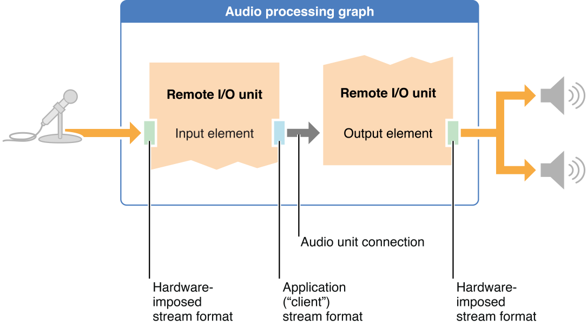
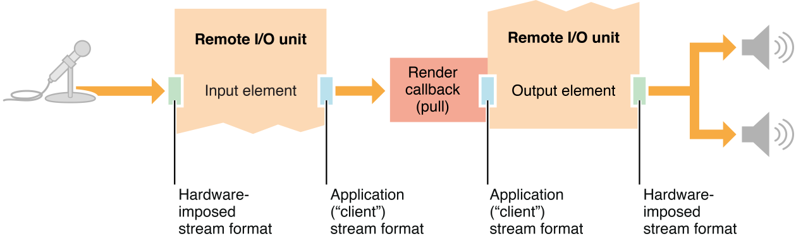
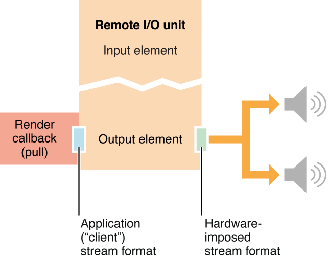
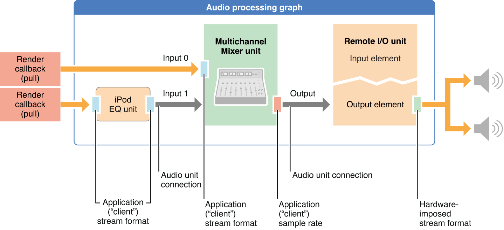

# Constructing Audio Unit Apps

现在你已经理解了音频单元是如何工作的，就像在 [Audio Unit Hosting Fundamentals](https://developer.apple.com/library/archive/documentation/MusicAudio/Conceptual/AudioUnitHostingGuide_iOS/AudioUnitHostingFundamentals/AudioUnitHostingFundamentals.html#//apple_ref/doc/uid/TP40009492-CH3-SW11) 中所解释的那样，你已经为构建应用的音频单元部分做好了准备。主要步骤是选择一个设计模式，然后编写代码来实现该模式。

## Start by Choosing a Design Pattern

在iOS应用中音频单元有 6 种基本设计模式。首先选择最能代表你希望应用如何处理音频的模式。当您学习每个模式时，请注意它们的共同特征。每一个模式:

- 只有一个 I/O 单元
- 在整个 audio processing graph 中使用单一的音频流格式—尽管该格式可以有变体，例如单声道和立体声流输入混音单元
- 要求您在特定位置设置流格式或流格式的部分

正确设置流格式是建立音频数据流的必要条件。这些模式中的大多数依赖于音频流格式从源到目标的自动传播，如音频单元连接所提供的那样。尽可能地利用这种传播，因为它减少了编写和维护的代码量。与此同时，请确保您了解需要在何处设置流格式。例如，您必须在iPod EQ单元的输入和输出上设置完整的流格式。对于所有iOS音频单元流格式要求，请参考 [Using Specific Audio Units](https://developer.apple.com/library/archive/documentation/MusicAudio/Conceptual/AudioUnitHostingGuide_iOS/UsingSpecificAudioUnits/UsingSpecificAudioUnits.html#//apple_ref/doc/uid/TP40009492-CH17-SW1)

在大多数情况下，本章中的设计模式使用了 audio processing graph ( [AUGraph](https://developer.apple.com/documentation/audiotoolbox/augraph)类型 )。您可以在不使用 graph 的情况下实现这些模式中的任何一种，但是使用 graph 可以简化代码并支持动态重新配置，如 [Audio Processing Graphs Manage Audio Units](https://developer.apple.com/library/archive/documentation/MusicAudio/Conceptual/AudioUnitHostingGuide_iOS/AudioUnitHostingFundamentals/AudioUnitHostingFundamentals.html#//apple_ref/doc/uid/TP40009492-CH3-SW23) 中所述

### 1. I/O Pass Through

I/O pass-through 模式将传入的音频直接发送到输出硬件，没有选项来处理音频数据。尽管这并没有什么实用价值，但基于这种模式构建音频单元托管应用是验证和巩固你对音频单元概念理解的好方法。该模式如图2-1所示。

**Figure 2-1** Simultaneous I/O pass through



从图中可以看到，音频输入硬件将其流格式施加到 Remote I/O单元 的 Input element 的向外的一端。反过来，您可以指定希望在该element的向内一端使用的格式。音频单元根据需要进行格式转换。为了避免不必要的采样率转换，请确保在定义流格式时使用音频硬件采样率

Input element 在默认情况下是禁用的，所以请确保启用它

图2-1所示的模式利用了两个 Remote I/O elements 之间的音频单元连接。具体来说，您不需要在音频单元的 output element 的 input scope 上设置流格式。音频单元连接将传递您为 input element 指定的格式

Output element 向外的一侧采用音频输出硬件的流格式，output element 根据需要为输出音频执行格式转换

使用此模式，您不需要配置任何音频数据缓冲区

### 2. I/O Without a Render Callback Function

在Remote I/O单元的element之间添加一个或多个其他音频单元可以让你构建一个更有趣的应用程序。例如，你可以使用一个Multichannel Mixer单元来定位传入的麦克风音频在立体声领域或提供输出音量控制。在这种设计模式下，仍然没有回调函数，如图2-2所示。这简化了模式，但限制了它的效用。如果没有渲染回调函数，你就没有办法直接操纵音频。

**Figure 2-2** Simultaneous I/O without a render callback function


在此模式中，与在 pass-through 模式中一样，配置 Remote I/O单元的两个元素。要设置Multichannel Mixer单元，您必须在Mixer output 上设置流格式的采样率，如图2-2所示。

mixer的输入流格式是通过 Remote I/O单元的 Input element 的输出，通过音频单元连接自动建立的。类似地，Remote I/O单元 Output element 的 input scope 的流格式是通过音频单元连接建立的，这要感谢 mixer单元 output 的传递。

在此模式的任何实例中，实际上，无论何时除了I/O单元之外使用其他音频单元，您必须设置[kAudioUnitProperty_MaximumFramesPerSlice](https://developer.apple.com/documentation/audiotoolbox/1534199-generic_audio_unit_properties/kaudiounitproperty_maximumframesperslice) 属性，如 *[Audio Unit Properties Reference](https://developer.apple.com/documentation/audiounit/audio_unit_properties)* 中所述

### 3. I/O with a Render Callback Function

通过在Remote I/O单元的 input 和 output element 之间放置回调函数，您可以在传入音频到达输出硬件之前对其进行操作。在一个非常简单的情况下，您可以使用渲染回调函数来调整输出音量。然而，你可以添加颤音、铃声调制、回声或其他效果。通过利用 Accelerate框架 (参见*[Accelerate Framework Reference](https://developer.apple.com/documentation/accelerate)*) 中提供的傅里叶变换和卷积函数，您的可能性是无限的。该模式如图2-3所示。

**Figure 2-3** Simultaneous I/O with a render callback function



从图中可以看到，该模式使用了 Remote I/O单元的两个element，就像本章前面的模式一样。将呈现回调函数附加到 output element 的 input scope。当该element需要另一组音频样本值时，它会调用回调。反过来，您的回调通过调用Remote I/O单元的 input element 的呈现回调函数来获得新的示例。

就像其他I/O模式一样，您必须显式地在 Remote I/O单元上开启输入模块，因为输入在默认情况下是禁用的。对于其他I/O模式，您不需要配置任何音频数据缓冲区。

请注意，当您使用渲染回调函数建立从一个音频单元到另一个音频单元的音频路径时，就像在此模式中一样，回调将取代音频单元连接

### 4. Output-Only with a Render Callback Function

选择这种模式用于音乐游戏和合成器—你正在生成声音并需要最大响应的应用程序。最简单的是，这个模式涉及一个直接连接到 Remote I/O单元 output element 的 input scope 的呈现回调函数，如图2-4所示。

**Figure 2-4** Output-only with a render callback function



你也可以使用同样的模式去构建带有更复杂音频结构的应用。例如，您可能希望生成几种声音，将它们混合在一起，然后通过设备的输出硬件播放它们。如图2-5所示。在这里，模式采用了一个 audio processing graph 和两个额外的音频单元，一个Multichannel Mixer和一个iPod EQ。

**Figure 2-5** A more complex example of output-only with a render callback function



在图中，请注意iPod EQ要求您在输入和输出上设置完整的流格式。另一方面，Multichannel Mixer只需要在其输出上设置正确的采样率。然后，完整的流格式通过音频单元连接从混频器的输出传播到远程I/O单元的输出元素的输入范围。这些使用细节以及使用各种iOS音频单元的其他细节将在[Using Specific Audio Units](https://developer.apple.com/library/archive/documentation/MusicAudio/Conceptual/AudioUnitHostingGuide_iOS/UsingSpecificAudioUnits/UsingSpecificAudioUnits.html#//apple_ref/doc/uid/TP40009492-CH17-SW1)中进行描述

对于每个Multichannel Mixer单元输入，如图2-5所示，完整的流格式设置。对于 input 0，您显式地设置它。对于 input 1 格式通过iPod EQ单元的输出连接的音频单元传播。通常，您必须单独考虑每个音频单元的流格式需求

### 5. Other Audio Unit Hosting Design Patterns

还有另外两种主要的音频单元设计模式。录音 或 分析音频，创建一个只有 input 和渲染回调函数的应用程序。回调函数由您的应用程序调用，然后它反过来调用 Remote I/O单元的 input element 的呈现方法。然而，在大多数情况下，像这样的应用程序更好的选择是使用输入音频队列对象(类型为[AudioQueueRef](https://developer.apple.com/documentation/audiotoolbox/audioqueueref)，使用 [AudioQueueNewInput](https://developer.apple.com/documentation/audiotoolbox/1501687-audioqueuenewinput) 函数实例化)，如 *[Audio Queue Services Programming Guide](https://developer.apple.com/library/archive/documentation/MusicAudio/Conceptual/AudioQueueProgrammingGuide/Introduction/Introduction.html#//apple_ref/doc/uid/TP40005343)* 中解释的那样。使用音频队列对象提供了更大的灵活性，因为它的渲染回调函数不是在实时线程上。

若要执行离线音频处理，请使用 Generic Output unit。与Remote I/O单元不同，此音频单元不连接到设备的音频硬件。当您使用它发送音频到您的应用程序时，它取决于您的应用程序调用其呈现方法。


## Constructing Your App

无论你选择哪种设计模式，构建音频单元托管应用的步骤基本上是相同的:

1. 配置您的 audio session
2. 指定 audio units
3. 创建 audio processing graph，然后获取 audio units
4. 配置 audio units
5. 连接 audio units nodes （音频单元节点）
6. 提供 ui
7. 初始化并启动 audio processing graph

### 1. Configure Your Audio Session

构建音频单元应用程序的第一步与任何iOS音频应用程序的步骤相同 :配置音频会话。音频会话的特征很大程度上决定了应用程序的音频功能及其与系统其余部分的交互性。首先，指定您想在应用程序中使用的采样率，如下所示:

``` objective-c
self.graphSampleRate = 44100.0; // Hertz
```

接下来，使用音频会话对象请求系统使用您喜欢的采样率作为设备硬件采样率，如清单2-1所示。这里的目的是为了避免硬件和应用程序之间的采样率转换。这将最大化CPU性能和声音质量，并最小化电池消耗

**Listing 2-1** Configuring an audio session

``` objective-c
NSError *audioSessionError = nil;
AVAudioSession *mySession = [AVAudioSession sharedInstance];     // 1
[mySession setPreferredHardwareSampleRate: graphSampleRate       // 2
                                    error: &audioSessionError];
[mySession setCategory: AVAudioSessionCategoryPlayAndRecord      // 3
                                    error: &audioSessionError];
[mySession setActive: YES                                        // 4
               error: &audioSessionError];
self.graphSampleRate = [mySession currentHardwareSampleRate];    // 5
```

上面几行代码的作用如下:

1. 为您的应用程序获取对单例音频会话对象的引用
2. 请求硬件的采样率。系统可能处理请求，也可能不理睬，这取决于设备上的其他音频活动
3. 请求您想要的音频会话类别。这里指定的 “play and record” 类别支持音频输入和输出
4. 请求激活您的音频会话
5. 音频会话激活后，根据系统提供的实际采样率更新自己的采样率变量

您可能需要配置另一个硬件特性:音频硬件 I/O buffer 时间。在44.1 kHz采样率下，默认持续时间约为23毫秒，相当于1024个采样的片大小。如果I/O延迟在你的应用中非常重要，你可以请求一个更短的持续时间，降低到 0.005毫秒 (相当于256个样本)，如下所示:

``` objective-c
self.ioBufferDuration = 0.005;
[mySession setPreferredIOBufferDuration: ioBufferDuration
                                  error: &audioSessionError];
```

有关如何配置和使用音频会话对象的完整说明，请参见 *[Audio Session Programming Guide](https://developer.apple.com/library/archive/documentation/Audio/Conceptual/AudioSessionProgrammingGuide/Introduction/Introduction.html#//apple_ref/doc/uid/TP40007875)*

### 2. Specify the Audio Units You Want

在运行时，在你的音频会话配置代码运行后，你的应用程序还没有获得音频单元。您可以通过使用[AudioComponentDescription](https://developer.apple.com/documentation/audiotoolbox/audiocomponentdescription) 结构体来指定您想要的每个组件。请参见 [Use Identifiers to Specify and Obtain Audio Units](https://developer.apple.com/library/archive/documentation/MusicAudio/Conceptual/AudioUnitHostingGuide_iOS/AudioUnitHostingFundamentals/AudioUnitHostingFundamentals.html#//apple_ref/doc/uid/TP40009492-CH3-SW19) 来了解如何做到这一点。每个iOS音频单元的标识符键都列在 [Identifier Keys for Audio Units](https://developer.apple.com/library/archive/documentation/MusicAudio/Conceptual/AudioUnitHostingGuide_iOS/UsingSpecificAudioUnits/UsingSpecificAudioUnits.html#//apple_ref/doc/uid/TP40009492-CH17-SW14)

如果有了音频单元说明符，您就可以根据所选择的模式构建 audio processing graph

### 3. Build an Audio Processing Graph

在这一步中，您将创建本章第一部分中解释的设计模式的框架。具体地说

1. 实例化一个 [AUGraph](https://developer.apple.com/documentation/audiotoolbox/augraph) 不透明类型。该实例表示音频处理图 (audio processing graph)
2. 实例化一个或多个 [AUNode](https://developer.apple.com/documentation/audiotoolbox/aunode) 不透明类型，每个类型代表 graph 中的一个音频单元
3. 将 nodes 添加到 graph 中
4. 打开 graph 并实例化音频单元
5. 获取对音频单元的引用

清单2-2显示了如何为包含 Remote I/O单元和Multichannel Mixer单元的 graph 执行这些步骤。它假设您已经为每个音频单元定义了一个 [AudioComponentDescription](https://developer.apple.com/documentation/audiotoolbox/audiocomponentdescription) 结构体

**Listing 2-2** Building an audio processing graph

``` objective-c
AUGraph processingGraph;
NewAUGraph (&processingGraph);
 
AUNode ioNode;
AUNode mixerNode;
 
AUGraphAddNode (processingGraph, &ioUnitDesc, &ioNode);
AUGraphAddNode (processingGraph, &mixerDesc, &mixerNode);
```

[AUGraphAddNode](https://developer.apple.com/documentation/audiotoolbox/1501671-augraphaddnode) 函数调用使用了音频单元说明符 *ioUnitDesc* 和 *mixerDesc*。此时，graph 将被实例化并拥有你将在应用中使用的 nodes。要打开 graph 并实例化音频单元，请调用[AUGraphOpen](https://developer.apple.com/documentation/audiotoolbox/1502571-augraphopen):

``` objective-c
AUGraphOpen (processingGraph);
```

然后，通过 [AUGraphNodeInfo](https://developer.apple.com/documentation/audiotoolbox/1502407-augraphnodeinfo) 函数获取对音频单元实例的引用，如下所示:

``` c
AudioUnit ioUnit;
AudioUnit mixerUnit;
 
AUGraphNodeInfo (processingGraph, ioNode, NULL, &ioUnit);
AUGraphNodeInfo (processingGraph, mixerNode, NULL, &mixerUnit);
```

 `ioUnit` 和 `mixerUnit` 变量现在包含了对 graph 中音频单元实例的引用，允许您配置并互连音频单元。

### 4. Configure the Audio Units

每个iOS音频单元都需要自己的配置，如 [Using Specific Audio Units](https://developer.apple.com/library/archive/documentation/MusicAudio/Conceptual/AudioUnitHostingGuide_iOS/UsingSpecificAudioUnits/UsingSpecificAudioUnits.html#//apple_ref/doc/uid/TP40009492-CH17-SW1) 所述。然而，有些配置非常常见，所有iOS音频开发者都应该熟悉它们。

默认情况下，Remote I/O 单元启用了输出，禁用了输入。如果你的应用程序同时执行I/O，或者只使用输入，你必须相应地重新配置 I/O单元。详细信息，请参见 *[Audio Unit Properties Reference](https://developer.apple.com/documentation/audiounit/audio_unit_properties)* 中的 [kAudioOutputUnitProperty_EnableIO](https://developer.apple.com/documentation/audiotoolbox/1534116-i_o_audio_unit_properties/kaudiooutputunitproperty_enableio) 属性。

所有iOS音频单元，除了Remote I/O 和 Voice-Processing I/O units，需要他们的`kAudioUnitProperty_MaximumFramesPerSlice` 属性配置。此属性确保音频单元已准备好产生足够数量的音频数据帧以响应渲染调用。详细信息，请参见 *[Audio Unit Properties Reference](https://developer.apple.com/documentation/audiounit/audio_unit_properties)* 中的 [kAudioUnitProperty_MaximumFramesPerSlice](https://developer.apple.com/documentation/audiotoolbox/1534199-generic_audio_unit_properties/kaudiounitproperty_maximumframesperslice)

所有音频单元都需要它们的音频流格式定义在输入，输出，或两者。有关音频流格式的解释，请参见 [Audio Stream Formats Enable Data Flow](https://developer.apple.com/library/archive/documentation/MusicAudio/Conceptual/AudioUnitHostingGuide_iOS/AudioUnitHostingFundamentals/AudioUnitHostingFundamentals.html#//apple_ref/doc/uid/TP40009492-CH3-SW40)。关于不同iOS音频单元的特定流格式要求，请参见 [Using Specific Audio Units](https://developer.apple.com/library/archive/documentation/MusicAudio/Conceptual/AudioUnitHostingGuide_iOS/UsingSpecificAudioUnits/UsingSpecificAudioUnits.html#//apple_ref/doc/uid/TP40009492-CH17-SW1)

### 5. Write and Attach Render Callback Functions

对于使用回调函数的设计模式，必须编写这些函数，然后将它们附加到正确的位置。[Render Callback Functions Feed Audio to Audio Units](https://developer.apple.com/library/archive/documentation/MusicAudio/Conceptual/AudioUnitHostingGuide_iOS/AudioUnitHostingFundamentals/AudioUnitHostingFundamentals.html#//apple_ref/doc/uid/TP40009492-CH3-SW27) 描述了这些回调函数做什么，并解释了它们是如何工作的

当音频不流动时，您可以通过使用音频单元API立即附加一个回调，如清单2-3所示。

**Listing 2-3** Attaching a render callback immediately

``` c
AURenderCallbackStruct callbackStruct;
callbackStruct.inputProc        = &renderCallback;
callbackStruct.inputProcRefCon  = soundStructArray;
 
AudioUnitSetProperty (
    myIOUnit,
    kAudioUnitProperty_SetRenderCallback,
    kAudioUnitScope_Input,
    0,                 // output element
    &callbackStruct,
    sizeof (callbackStruct)
);
```

您可以使用 audio processing graph API，以线程安全的方式附加渲染回调，即使音频是流动的。清单2-4显示了如何做到这一点。

**Listing 2-4** Attaching a render callback in a thread-safe manner

``` c
AURenderCallbackStruct callbackStruct;
callbackStruct.inputProc        = &renderCallback;
callbackStruct.inputProcRefCon  = soundStructArray;
 
AUGraphSetNodeInputCallback (
    processingGraph,
    myIONode,
    0,                 // output element
    &callbackStruct
);
// ... some time later
Boolean graphUpdated;
AUGraphUpdate (processingGraph, &graphUpdated);
```

### 6. Connect the Audio Unit Nodes

在大多数情况下，使用 audio processing graph API 中的 [AUGraphConnectNodeInput](https://developer.apple.com/documentation/audiotoolbox/1502636-augraphconnectnodeinput) 和 [AUGraphDisconnectNodeInput](https://developer.apple.com/documentation/audiotoolbox/1502008-augraphdisconnectnodeinput) 函数在音频单元之间建立或断开连接是最好的，也是更容易的。这些函数是线程安全的，避免了显式定义连接(不使用graph时必须这样做)的编码开销

清单2-5显示了如何使用音频处理图API将 mixer 节点的输出连接到 I/O单元输出元素的输入

**Listing 2-5** Connecting two audio unit nodes using the audio processing graph API

``` c
AudioUnitElement mixerUnitOutputBus  = 0;
AudioUnitElement ioUnitOutputElement = 0;
 
AUGraphConnectNodeInput (
    processingGraph,
    mixerNode,           // source node
    mixerUnitOutputBus,  // source node bus
    iONode,              // destination node
    ioUnitOutputElement  // desinatation node element
);
```

你也可以通过音频单元属性机制直接建立和断开音频单元之间的连接。为此，使用 [AudioUnitSetProperty](https://developer.apple.com/documentation/audiotoolbox/1440371-audiounitsetproperty) 函数和 [kAudioUnitProperty_MakeConnection](https://developer.apple.com/documentation/audiotoolbox/1534199-generic_audio_unit_properties/kaudiounitproperty_makeconnection) 属性，如清单2-6所示。这种方法需要为每个连接定义一个 [AudioUnitConnection](https://developer.apple.com/documentation/audiotoolbox/audiounitconnection) 结构作为其属性值。

**Listing 2-6** Connecting two audio units directly

``` c
AudioUnitElement mixerUnitOutputBus  = 0;
AudioUnitElement ioUnitOutputElement = 0;
 
AudioUnitConnection mixerOutToIoUnitIn;
mixerOutToIoUnitIn.sourceAudioUnit    = mixerUnitInstance;
mixerOutToIoUnitIn.sourceOutputNumber = mixerUnitOutputBus;
mixerOutToIoUnitIn.destInputNumber    = ioUnitOutputElement;
 
AudioUnitSetProperty (
    ioUnitInstance,                     // connection destination
    kAudioUnitProperty_MakeConnection,  // property key
    kAudioUnitScope_Input,              // destination scope
    ioUnitOutputElement,                // destination element
    &mixerOutToIoUnitIn,                // connection definition
    sizeof (mixerOutToIoUnitIn)
);
```

### 7. Provide a User Interface

在构建应用程序的这一点上，音频单元(通常是音频处理图)已经完全构建和配置好了。在很多情况下，你会想要提供一个用户界面来让你的用户调整音频行为。您可以定制用户界面，以允许用户调整特定的音频单元参数，在某些特殊情况下，还可以调整音频单元属性。无论哪种情况，用户界面都应该提供关于当前设置的视觉反馈

[Use Parameters and UIKit to Give Users Control](https://developer.apple.com/library/archive/documentation/MusicAudio/Conceptual/AudioUnitHostingGuide_iOS/AudioUnitHostingFundamentals/AudioUnitHostingFundamentals.html#//apple_ref/doc/uid/TP40009492-CH3-SW21) 解释了构建用户界面让用户控制参数值的基础知识

### 8. Initialize and Start the Audio Processing Graph

在启动音频流之前，必须通过调用 [AUGraphInitialize](https://developer.apple.com/documentation/audiotoolbox/1503251-augraphinitialize) 函数初始化音频处理图。关键步骤如下：

- 通过自动地为每个音频单元单独调用AudioUnitInitialize函数来初始化图表所拥有的音频单元。(如果你想构建一个处理链而不使用图表，你就必须依次显式初始化每个音频单元。)
- 验证 graph 的连接和音频数据流格式
- 跨音频单元连接传递流格式

清单2-7显示了如何使用 [AUGraphInitialize](https://developer.apple.com/documentation/audiotoolbox/1503251-augraphinitialize)

**Listing 2-7** Initializing and starting an audio processing graph

``` c
OSStatus result = AUGraphInitialize (processingGraph);
// Check for error. On successful initialization, start the graph...
AUGraphStart (processingGraph);
 
// Some time later
AUGraphStop (processingGraph);
```


## Troubleshooting Tips（故障排除技巧）

当Core Audio函数提供返回值时，捕获该值并检查成功或失败。如果出现故障，可以使用Xcode的调试特性，详见*[Xcode Debugging Guide](https://developer.apple.com/library/archive/documentation/DeveloperTools/Conceptual/XcodeDebugging/000-Introduction/Introduction.html#//apple_ref/doc/uid/TP40007057)*。如果在你的应用中使用Objective-C方法，比如配置音频会话，那么同样可以利用error参数。

注意函数调用之间的依赖关系。例如，只有在成功初始化 audio processing graph 之后，才能启动它。检查 `AUGraphInitialize` 的返回值。如果函数成功返回，则可以开始 graph。如果失败了，确定是哪里出了问题。检查初始化之前的所有音频单元函数调用是否成功返回

第二，如果 graph 初始化失败，利用 [CAShow](https://developer.apple.com/documentation/audiotoolbox/1475988-cashow) 函数。这个函数将graph的状态打印到Xcode控制台。

确保你将每个 [AudioStreamBasicDescription](https://developer.apple.com/documentation/coreaudio/audiostreambasicdescription) 结构体初始化为0，如下所示:

``` c
AudioStreamBasicDescription stereoStreamFormat = {0};
```

将ASBD的字段初始化为0可以确保没有字段包含垃圾数据。(在外部存储中声明数据结构时—例如，在类声明中作为实例变量—其字段会自动初始化为0，而不需要您自己初始化它们)

要将 AudioStreamBasicDescription 结构的字段值打印到Xcode控制台(这在开发过程中非常有用)，请使用如清单2-8所示的代码。

**Listing 2-8** A utility method to print field values for an `AudioStreamBasicDescription` structure

``` objective-c
- (void) printASBD: (AudioStreamBasicDescription) asbd {
 
    char formatIDString[5];
    UInt32 formatID = CFSwapInt32HostToBig (asbd.mFormatID);
    bcopy (&formatID, formatIDString, 4);
    formatIDString[4] = '\0';
 
    NSLog (@"  Sample Rate:         %10.0f",  asbd.mSampleRate);
    NSLog (@"  Format ID:           %10s",    formatIDString);
    NSLog (@"  Format Flags:        %10X",    asbd.mFormatFlags);
    NSLog (@"  Bytes per Packet:    %10d",    asbd.mBytesPerPacket);
    NSLog (@"  Frames per Packet:   %10d",    asbd.mFramesPerPacket);
    NSLog (@"  Bytes per Frame:     %10d",    asbd.mBytesPerFrame);
    NSLog (@"  Channels per Frame:  %10d",    asbd.mChannelsPerFrame);
    NSLog (@"  Bits per Channel:    %10d",    asbd.mBitsPerChannel);
}
```

该实用方法可以快速发现ASBD中的问题

当为音频单元流格式定义ASBD时，请确保您遵循了 [Using Specific Audio Units](https://developer.apple.com/library/archive/documentation/MusicAudio/Conceptual/AudioUnitHostingGuide_iOS/UsingSpecificAudioUnits/UsingSpecificAudioUnits.html#//apple_ref/doc/uid/TP40009492-CH17-SW1) 中的“推荐的流格式属性”和“流格式说明”。不要偏离这些建议，除非你有特殊的理由。


[Constructing Audio Unit Apps](https://developer.apple.com/library/archive/documentation/MusicAudio/Conceptual/AudioUnitHostingGuide_iOS/ConstructingAudioUnitApps/ConstructingAudioUnitApps.html#//apple_ref/doc/uid/TP40009492-CH16-SW1)

