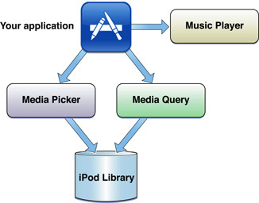

iOS提供了一组丰富的工具，用于在应用程序中处理声音。这些工具根据它们提供的不同特性被分类为不同的frameworks，如下所示:

- 使用 Media Player framework 从用户的iPod库中播放歌曲、音频书籍或音频播客。有关详细信息，请参见  *[Media Player Framework Reference](https://developer.apple.com/documentation/mediaplayer)*, *[iPod Library Access Programming Guide](https://developer.apple.com/library/archive/documentation/Audio/Conceptual/iPodLibraryAccess_Guide/Introduction/Introduction.html#//apple_ref/doc/uid/TP40008765)*, 和 *[AddMusic](https://developer.apple.com/library/archive/samplecode/AddMusic/Introduction/Intro.html#//apple_ref/doc/uid/DTS40008845)* 简单的代码示例
- 使用 AV Foundation framework 播放和录音 使用一个简单的Objective-C接口。详细信息请参见 *[AV Foundation Framework Reference](https://developer.apple.com/documentation/avfoundation)* 和简单示例程序  *[avTouch](https://developer.apple.com/library/archive/samplecode/avTouch/Introduction/Intro.html#//apple_ref/doc/uid/DTS40008636)* 
- 使用 *Audio Toolbox framework* 播放带有同步功能的音频，访问传入音频的数据包，解析音频流，转换音频格式，并通过访问单个数据包记录音频。有关详细信息，请参见 *[Audio Toolbox Framework Reference](https://developer.apple.com/documentation/audiotoolbox)* 
- 使用 *Audio Unit framework* 来连接和使用音频处理插件。详细信息请参见 *[Audio Unit Hosting Guide for iOS](https://developer.apple.com/library/archive/documentation/MusicAudio/Conceptual/AudioUnitHostingGuide_iOS/Introduction/Introduction.html#//apple_ref/doc/uid/TP40009492)*
- 使用 *OpenAL framework* 在游戏和其他应用程序中提供位置音频回放。iOS支持OpenAL 1.1。有关OpenAL的信息，请参阅 [OpenAL](http://openal.org/) 网站、*[OpenAL FAQ for iPhone OS](https://developer.apple.com/library/archive/technotes/tn2199/_index.html#//apple_ref/doc/uid/DTS40007999)*


这一节将快速介绍iOS音频功能的实现，如下所示:

- 要从用户的iPod库中播放歌曲、音频播客和音频书籍，请参阅  [Playing Audio Items with iPod Library Access](https://developer.apple.com/library/archive/documentation/AudioVideo/Conceptual/MultimediaPG/UsingAudio/UsingAudio.html#//apple_ref/doc/uid/TP40009767-CH2-SW43)
- 用最少的代码实现播放和录音功能，使用AV Foundation framework。 [Playing Sounds Easily with the AVAudioPlayer Class](https://developer.apple.com/library/archive/documentation/AudioVideo/Conceptual/MultimediaPG/UsingAudio/UsingAudio.html#//apple_ref/doc/uid/TP40009767-CH2-SW2) 和 [Recording with the AVAudioRecorder Class](https://developer.apple.com/library/archive/documentation/AudioVideo/Conceptual/MultimediaPG/UsingAudio/UsingAudio.html#//apple_ref/doc/uid/TP40009767-CH2-SW14).
- 要提供功能齐全的音频播放，包括立体声定位、电平控制和同步声音，请使用OpenAL。参见使用 [Playing Sounds with Positioning Using OpenAL](https://developer.apple.com/library/archive/documentation/AudioVideo/Conceptual/MultimediaPG/UsingAudio/UsingAudio.html#//apple_ref/doc/uid/TP40009767-CH2-SW3).
- 要提供最低延迟的音频，特别是在同时进行输入和输出时(如VoIP应用程序)，请使用 I/O unit 或 Voice Processing I/O unit。参见  [Audio Unit Support in iOS](https://developer.apple.com/library/archive/documentation/AudioVideo/Conceptual/MultimediaPG/UsingAudio/UsingAudio.html#//apple_ref/doc/uid/TP40009767-CH2-SW4).
- 要播放具有最高控制程度的声音，包括支持同步，请使用 Audio Queue Services。请参阅 [Playing Sounds with Control Using Audio Queue Services](https://developer.apple.com/library/archive/documentation/AudioVideo/Conceptual/MultimediaPG/UsingAudio/UsingAudio.html#//apple_ref/doc/uid/TP40009767-CH2-SW5)。音频队列服务还支持录音，并提供对传入音频数据包的访问，如 [Recording with Audio Queue Services](https://developer.apple.com/library/archive/documentation/AudioVideo/Conceptual/MultimediaPG/UsingAudio/UsingAudio.html#//apple_ref/doc/uid/TP40009767-CH2-SW16)所述
- 要解析来自网络连接的音频流，请使用 Audio File Stream Services。参见 [Parsing Streamed Audio](https://developer.apple.com/library/archive/documentation/AudioVideo/Conceptual/MultimediaPG/UsingAudio/UsingAudio.html#//apple_ref/doc/uid/TP40009767-CH2-SW8)
- 要播放ui界面音效，或在提供该功能的设备上调用振动，请使用 System Sound Services。参见  [Playing UI Sound Effects or Invoking Vibration Using System Sound Services](https://developer.apple.com/library/archive/documentation/AudioVideo/Conceptual/MultimediaPG/UsingAudio/UsingAudio.html#//apple_ref/doc/uid/TP40009767-CH2-SW1)


请务必阅读 [The Basics: Audio Codecs, Supported Audio Formats, and Audio Sessions](https://developer.apple.com/library/archive/documentation/AudioVideo/Conceptual/MultimediaPG/UsingAudio/UsingAudio.html#//apple_ref/doc/uid/TP40009767-CH2-SW9)，关于音频如何在iOS中工作的关键信息。此外，还可以阅读 [Best Practices for iOS Audio](https://developer.apple.com/library/archive/documentation/AudioVideo/Conceptual/MultimediaPG/UsingAudio/UsingAudio.html#//apple_ref/doc/uid/TP40009767-CH2-SW10)，它提供了指南，并列出了用于获得最佳性能和最佳用户体验的音频和文件格式。

关于iOS音频开发的深入解释，请参见 *[Core Audio Overview](https://developer.apple.com/library/archive/documentation/MusicAudio/Conceptual/CoreAudioOverview/Introduction/Introduction.html#//apple_ref/doc/uid/TP40003577)*,  *[Audio Session Programming Guide](https://developer.apple.com/library/archive/documentation/Audio/Conceptual/AudioSessionProgrammingGuide/Introduction/Introduction.html#//apple_ref/doc/uid/TP40007875)*,  *[Audio Queue Services Programming Guide](https://developer.apple.com/library/archive/documentation/MusicAudio/Conceptual/AudioQueueProgrammingGuide/Introduction/Introduction.html#//apple_ref/doc/uid/TP40005343)*,  *[Audio Unit Hosting Guide for iOS](https://developer.apple.com/library/archive/documentation/MusicAudio/Conceptual/AudioUnitHostingGuide_iOS/Introduction/Introduction.html#//apple_ref/doc/uid/TP40009492)*, 和 [iPod Library Access Programming Guide](https://developer.apple.com/library/archive/documentation/Audio/Conceptual/iPodLibraryAccess_Guide/Introduction/Introduction.html#//apple_ref/doc/uid/TP40008765)


## The Basics: Audio Codecs, Supported Audio Formats, and Audio Sessions（音频编解码器，支持的音频格式和音频会话）

为了面向iOS音频开发，我们必须了解iOS设备的硬件和软件架构。


### iOS Hardware and Software Audio Codecs（iOS硬件和软件音频编解码器）

为了确保最佳的性能和质量，您需要选择正确的音频格式和音频编解码器类型。从iOS 3.0开始，大多数音频格式可以使用基于软件的编码(用于录制)和解码(用于播放)。软件编解码器支持多种声音的同时播放，但可能需要大量的CPU开销。

硬件辅助解码提供了出色的性能—但不支持多个声音的同时播放。如果您需要最大化应用程序中的视频帧率，可以通过使用未压缩音频或IMA4格式，或使用硬件辅助解码压缩音频资产来最小化音频回放的CPU影响。

关于选择音频格式的最佳实践建议，请参阅 [Preferred Audio Formats in iOS](https://developer.apple.com/library/archive/documentation/AudioVideo/Conceptual/MultimediaPG/UsingAudio/UsingAudio.html#//apple_ref/doc/uid/TP40009767-CH2-SW28)


iOS设备提供的播放音频编解码器如下所示

| Audio decoder/playback format                                | Hardware-assisted decoding | Software-based decoding  |
| :----------------------------------------------------------- | :------------------------- | :----------------------- |
| AAC (MPEG-4 Advanced Audio Coding)                           | Yes                        | Yes, starting in iOS 3.0 |
| ALAC (Apple Lossless)                                        | Yes                        | Yes, starting in iOS 3.0 |
| HE-AAC (MPEG-4 High Efficiency AAC)                          | Yes                        | -                        |
| iLBC (internet Low Bitrate Codec, another format for speech) | -                          | Yes                      |
| IMA4 (IMA/ADPCM)                                             | -                          | Yes                      |
| Linear PCM (uncompressed, linear pulse-code modulation)      | -                          | Yes                      |
| MP3 (MPEG-1 audio layer 3)                                   | Yes                        | Yes, starting in iOS 3.0 |
| µ-law and a-law                                              | -                          | Yes                      |

当使用硬件辅助解码时，设备一次只能播放支持格式之一的单个实例。例如，如果您正在使用硬件编解码器播放立体声MP3声音，那么第二个同时播放的MP3声音将使用软件解码。同样，您也不能使用硬件同时播放AAC和ALAC声音。如果iPod应用程序在后台播放AAC或MP3的声音，它声称是硬件编解码器;你的应用程序然后播放AAC, ALAC和MP3音频使用软件解码。

使用 linear PCM(未压缩) 或 IMA4(压缩) 音频以最佳性能播放多个声音，或在iPod播放背景时高效播放声音。

总结一下iOS是如何支持单个或多个播放的音频格式的:

- linear PCM 和 IMA4 (IMA/ADPCM) 你可以在iOS中同时播放多个 linear PCM 或 IMA4 声音，而不会引起CPU资源问题。iLBC语音质量格式、µ-law和a-law压缩格式也是如此。当使用压缩格式时，请检查声音质量以确保它符合您的需要。
- AAC, HE-AAC, MP3和ALAC (Apple Lossless) 播放AAC, HE-AAC, MP3和ALAC的声音可以在iOS设备上使用高效的硬件辅助解码，但这些编解码器都共享一个硬件路径。使用硬件辅助解码，设备一次只能播放其中一种格式的单个实例。

AAC、HE-AAC、MP3和ALAC播放的单一硬件路径意味着“一起演奏”风格的应用程序，例如虚拟钢琴。如果用户在iPod应用程序中播放这三种格式之一的歌曲，那么你的应用程序在播放该音频时将使用软件解码。


iOS设备支持的录音音频编解码器如下所示：

| Audio encoder/recording format                          | Hardware-assisted encoding                                   | Software-based encoding                                      |
| :------------------------------------------------------ | :----------------------------------------------------------- | :----------------------------------------------------------- |
| AAC (MPEG-4 Advanced Audio Coding)                      | Yes, starting in iOS 3.1 for iPhone 3GS and iPod touch (2nd generation)Yes, starting in iOS 3.2 for iPad | Yes, starting in iOS 4.0 for iPhone 3GS and iPod touch (2nd generation) |
| ALAC (Apple Lossless)                                   | -                                                            | Yes                                                          |
| iLBC (internet Low Bitrate Codec, for speech)           | -                                                            | Yes                                                          |
| IMA4 (IMA/ADPCM)                                        | -                                                            | Yes                                                          |
| Linear PCM (uncompressed, linear pulse-code modulation) | -                                                            | Yes                                                          |
| µ-law and a-law                                         | -                                                            | Yes                                                          |


### Audio Sessions

iOS audio session APIs 让你定义你的应用程序的一般音频行为，并设计它在它所运行的设备的更大的音频环境中良好工作。这些api在  *[Audio Session Services Reference](https://developer.apple.com/documentation/audiotoolbox/audio_session_services)* 和 *[AVAudioSession Class Reference](https://developer.apple.com/documentation/avfoundation/avaudiosession)* 中描述。使用这些api，你可以指定这样的行为:

- 你的音频是否应该被静音开关静音 (在iPhone上，这被称为铃声/静音开关)
- 你的音频是否应该在屏幕锁定时停止
- 当你的音频开始播放时，其他的音频，比如来自iPod的，应该继续播放还是被静音

音频会话api还允许您响应用户操作(如插入或拔出耳机)，以及使用设备的声音硬件的事件(如Clock和Calendar警报和传入电话)

音频会话api提供了三个编程特性，如下所示：

| Audio session feature                    | Description                                                  |
| :--------------------------------------- | :----------------------------------------------------------- |
| Setting categories                       | 类别是识别应用程序音频行为的关键。通过设置类别，你可以向iOS显示你的音频意图，例如当屏幕锁定时音频是否应该继续。 [Responding to Interruptions](https://developer.apple.com/library/archive/documentation/Audio/Conceptual/AudioSessionProgrammingGuide/HandlingAudioInterruptions/HandlingAudioInterruptions.html#//apple_ref/doc/uid/TP40007875-CH4) 中描述了六种类型。您可以微调某些类别的行为，如  [Use Modes to Specialize the Category](https://developer.apple.com/library/archive/documentation/Audio/Conceptual/AudioSessionProgrammingGuide/AudioSessionBasics/AudioSessionBasics.html#//apple_ref/doc/uid/TP40007875-CH3-SW2) 中所述 |
| Handling interruptions and route changes | 当音频被打断时，当中断结束时，当硬件音频路由改变时，音频会话将发布消息。这些消息使您能够优雅地响应较大音频环境中的变化，例如由于传入电话而中断。具体操作请参见 [Audio Guidelines By App Type](https://developer.apple.com/library/archive/documentation/Audio/Conceptual/AudioSessionProgrammingGuide/AudioGuidelinesByAppType/AudioGuidelinesByAppType.html#//apple_ref/doc/uid/TP40007875-CH11) |
| Optimizing for hardware characteristics  | 您可以查询音频会话来发现运行应用程序的设备的特征，如硬件采样率、硬件通道的数量以及音频输入是否可用。详细信息请参见 [Optimizing for Device Hardware](https://developer.apple.com/library/archive/documentation/Audio/Conceptual/AudioSessionProgrammingGuide/RequestingPermission/RequestingPermission.html#//apple_ref/doc/uid/TP40007875-CH13) |

有两个接口用于处理音频会话：

-  *[AVAudioSession Class Reference](https://developer.apple.com/documentation/avfoundation/avaudiosession)* 和 *[AVAudioSessionDelegate Protocol Reference](https://developer.apple.com/documentation/avfoundation/avaudiosessiondelegate)* 描述了一个streamlined、Objective-C接口，允许你访问core audio会话特性
- 一个基于 C 的接口，提供对所有基本和高级音频会话功能的全面访问，在 *[Audio Session Services Reference](https://developer.apple.com/documentation/audiotoolbox/audio_session_services)* 中有描述

您可以混合和匹配使用来自 AV Foundation 和 Audio Session Services的音频会话代码，接口是完全兼容的。

音频会话带有一些默认行为，你可以使用它们开始开发。但是，除了某些特殊情况外，默认行为不适合使用音频的交付应用程序。

例如，当使用默认音频会话，音频在您的应用程序停止时，自动锁定时间超时和屏幕锁定。如果你想确保播放在屏幕锁定的情况下继续，在你的应用程序的初始化代码中包含以下几行:

``` c
NSError *setCategoryErr = nil;
NSError *activationErr  = nil;
[[AVAudioSession sharedInstance]
              setCategory: AVAudioSessionCategoryPlayback
                    error: &setCategoryErr];
[[AVAudioSession sharedInstance]
                setActive: YES
                    error: &activationErr];
```

AVAudioSessionCategoryPlayback 类别确保在屏幕锁定时播放继续。激活音频会话将使指定的类别生效。

如下表所示，您使用的音频技术不同，导致来电或闹钟或日历闹钟干扰阻断时，应如何处理：

| Audio technology                     | How interruptions work                                       |
| :----------------------------------- | :----------------------------------------------------------- |
| AV Foundation framework              | AVAudioPlayer 和 AVAudioRecorder 类提供了中断开始和结束的委托方法。实现这些方法来更新您的ui，并可选地在中断结束后恢复暂停的播放。系统自动暂停播放或录音中断，并重新激活您的音频会话时，您恢复播放或录音。<br>如果你想在程序启动时保存和恢复播放位置，需在中断和应用程序退出时保存播放位置 |
| Audio Queue Services, I/O audio unit | 这些技术使您的应用程序能够控制中断的处理。您负责保存播放或录音位置，并在中断结束后重新激活您的音频会话。实现 AVAudioSession 中断委托方法或编写一个中断监听器回调函数 |
| OpenAL                               | 当使用OpenAL进行播放时，实现 AVAudioSession 中断委托方法或编写一个中断监听器回调函数，就像使用音频队列服务一样。但是，委托或回调必须另外管理OpenAL上下文 |
| System Sound Services                | 当中断开始时，使用系统声音服务播放的声音将停止。如果中断结束，它们可以自动再次使用。应用程序不能影响使用此播放技术的声音的中断行为 |

每个iOS应用程序 (极少例外 )都应该积极管理其音频会话。关于如何做到这一点的完整解释，请阅读  *[Audio Session Programming Guide](https://developer.apple.com/library/archive/documentation/Audio/Conceptual/AudioSessionProgrammingGuide/Introduction/Introduction.html#//apple_ref/doc/uid/TP40007875)*。为了确保你的应用符合苹果关于音频会话行为的建议，请阅读 *iOS Human Interface Guidelines*


## Playing Audio

本节介绍在iOS上播放音频使用 iPod library access、System Sound Services、Audio Queue Services、AV Foundation framework 和 OpenAL

### Playing Audio Items with iPod Library Access

从iOS 3.0开始，iPod library访问允许你的应用程序播放用户的歌曲、音频书籍和音频播客。该API设计使得基本的播放非常简单，同时还支持高级搜索和播放控制。

如图所示，您的应用程序有两种方法来检索媒体项。左边显示的媒体项目选择器是一个易于使用的预打包视图控制器，它的行为就像内置的iPod应用程序的音乐选择界面。对于许多应用程序来说，这就足够了。如果选择器不提供所需的专门访问控制，则媒体查询接口将提供。它支持iPod库中基于谓词的项目规范。

 *[iPod Library Access Programming Guide](https://developer.apple.com/library/archive/documentation/Audio/Conceptual/iPodLibraryAccess_Guide/Introduction/Introduction.html#//apple_ref/doc/uid/TP40008765)*



### Playing UI Sound Effects or Invoking Vibration Using System Sound Services

要播放用户界面声音效果(如单击按钮)，或调用支持它的设备上的振动，请使用System Sound Services。这个紧凑的接口在*[System Sound Services Reference](https://developer.apple.com/documentation/audiotoolbox/system_sound_services)*中描述

> 注意: 使用系统声音服务播放的声音不受使用您的音频会话配置的影响。因此，您无法将系统声音服务音频的行为与应用程序中的其他音频行为保持一致。这是避免使用系统声音服务的最重要原因，除了它的预期用途。

AudioServicesPlaySystemSound 功能可以让你非常简单地播放短的声音文件。这种简单性带来了一些限制。你的声音文件必须是：

- 持续时间不超过30秒
- linear PCM or IMA4 (IMA/ADPCM) 格式
- 打包在 `.caf`、`.aif` 或 `.wav` 文件中

另外，当你使用 AudioServicesPlaySystemSound 函数时:

- 声音以当前系统音频音量播放，没有可编程音量控制
- 声音立即播放
- 循环定位和立体声定位不可用
- 无法同时播放: 一次只能播放一个声音

类似的 AudioServicesPlayAlertSound 函数将播放一个简短的声音作为警告。如果用户在铃声设置中设置了设备振动，调用此功能除了播放声音文件外，还会调用振动。

> 注意: 系统提供的警报声音和系统提供的用户界面声音效果对您的应用程序不可用。例如，使用kSystemSoundID_UserPreferredAlert常量作为AudioServicesPlayAlertSound函数的参数将不会播放任何内容。


要使用 AudioServicesPlaySystemSound 或 AudioServicesPlayAlertSound 函数播放声音，首先创建一个声音ID对象

``` c
// Get the main bundle for the app
CFBundleRef mainBundle = CFBundleGetMainBundle ();

// Get the URL to the sound file to play. The file in this case
// is "tap.aif"
soundFileURLRef  = CFBundleCopyResourceURL (
                       mainBundle,
                       CFSTR ("tap"),
                       CFSTR ("aif"),
                       NULL
                   );

// Create a system sound object representing the sound file
AudioServicesCreateSystemSoundID (
    soundFileURLRef,
    &soundFileObject
);
```

然后播放音频

``` c
- (IBAction) playSystemSound {
    AudioServicesPlaySystemSound (self.soundFileObject);
}
```

在典型的使用(包括偶尔或重复播放声音)中，保留声音ID对象，直到应用程序退出。如果您知道只会使用一次声音(例如，在启动声音的情况下)，那么可以在播放声音后立即销毁声音ID对象，从而释放内存。

运行在支持振动的iOS设备上的应用程序可以使用系统声音服务触发该功能。您可以使用kSystemSoundID_Vibrate 标识符指定振动选项。要触发它，请使用 AudioServicesPlaySystemSound 函数

``` c
#import <AudioToolbox/AudioToolbox.h>
#import <UIKit/UIKit.h>
- (void) vibratePhone {
    AudioServicesPlaySystemSound (kSystemSoundID_Vibrate);
}
```


### Playing Sounds Easily with the AVAudioPlayer Class

AVAudioPlayer 类提供了一个简单的播放声音的Objective-C接口。如果您的应用程序不需要立体声定位或精确同步，如果您不播放从网络流捕获的音频，苹果建议您使用这个类来播放。

使用 audio player 你可以：

- 播放任何持续时间的声音
- 从文件或内存缓冲区播放声音
- 循环播放声音
- 同时播放多个声音(虽然不是精确同步)
- 控制您正在播放的每个声音的播放关联级别
- 查找声音文件中的特定点，它支持应用程序特性，如快进和快退
- 获取音频功率数据，可以用于音频电平测量

AVAudioPlayer 类允许你在iOS中可用的任何音频格式的声音。有关该类接口的完整描述，请参阅 *[AVAudioPlayer Class Reference](https://developer.apple.com/documentation/avfoundation/avaudioplayer)*

要配置一个audio player：

- 将声音文件分配给音频播放器
- 准备播放 prepare，这需要它所需的硬件资源
- 指定一个音频播放器委托对象，用于处理中断和播放完成事件

``` c
// in the corresponding .h file:
// @property (nonatomic, retain) AVAudioPlayer *player;
 
// in the .m file:
@synthesize player; // the player object
 
NSString *soundFilePath =
            [[NSBundle mainBundle] pathForResource: @"sound"
                                            ofType: @"wav"];
 
NSURL *fileURL = [[NSURL alloc] initFileURLWithPath: soundFilePath];
 
AVAudioPlayer *newPlayer =
            [[AVAudioPlayer alloc] initWithContentsOfURL: fileURL
                                                   error: nil];
[fileURL release];
 
self.player = newPlayer;
[newPlayer release];
 
[player prepareToPlay];
[player setDelegate: self];
```

委托 (可以是你的控制器对象) 处理中断，并在声音播放结束时更新用户界面。AVAudioPlayer 类的委托方法在AVAudioPlayerDelegate 协议引用中描述。下面显示了一个委托方法的简单实现。这段代码在声音结束播放时更新播放/暂停切换按钮的标题。

``` c
- (void) audioPlayerDidFinishPlaying: (AVAudioPlayer *) player
                        successfully: (BOOL) completed {
    if (completed == YES) {
        [self.button setTitle: @"Play" forState: UIControlStateNormal];
    }
}
```

要播放、暂停或停止AVAudioPlayer对象，调用其播放控制方法之一时，可以使用 playing 属性测试播放是否正在进行中。下面显示了一个基本的播放/暂停切换方法，它控制播放和更新UIButton对象的标题

``` c
- (IBAction) playOrPause: (id) sender {
 
    // if already playing, then pause
    if (self.player.playing) {
        [self.button setTitle: @"Play" forState: UIControlStateHighlighted];
        [self.button setTitle: @"Play" forState: UIControlStateNormal];
        [self.player pause];
 
    // if stopped or paused, start playing
    } else {
        [self.button setTitle: @"Pause" forState: UIControlStateHighlighted];
        [self.button setTitle: @"Pause" forState: UIControlStateNormal];
        [self.player play];
    }
}
```

AVAudioPlayer 类使用Objective-C声明的属性特性来管理关于声音的信息—比如声音时间轴中的播放点，以及访问播放选项—比如音量和循环。例如，你可以设置一个音频播放器的播放音量如下所示:

``` c
[self.player setVolume: 1.0];    // available range is 0.0 through 1.0
```

有关 AVAudioPlayer 类的更多信息，参考 *[AVAudioPlayer Class Reference](https://developer.apple.com/documentation/avfoundation/avaudioplayer)*


### Playing Sounds with Control Using Audio Queue Services

Audio Queue Services 添加了 AVAudioPlayer 类之外的播放功能。使用音频队列服务播放可以让你:

- 精确地安排声音播放的时间，允许同步
- 精确控制音量在一个缓冲区的基础上
- 使用音频文件流服务播放从流中捕获的音频

Audio Queue Services允许你播放iOS中可用的任何音频格式的声音。您也可以使用此技术进行录音，如 [Recording Audio](https://developer.apple.com/library/archive/documentation/AudioVideo/Conceptual/MultimediaPG/UsingAudio/UsingAudio.html#//apple_ref/doc/uid/TP40009767-CH2-SW7)所述。

有关使用此技术的详细信息，请参见 *[Audio Queue Services Programming Guide](https://developer.apple.com/library/archive/documentation/MusicAudio/Conceptual/AudioQueueProgrammingGuide/Introduction/Introduction.html#//apple_ref/doc/uid/TP40005343)* 和 *[Audio Queue Services Reference](https://developer.apple.com/documentation/audiotoolbox/audio_queue_services)*

#### Creating an Audio Queue Object

要创建用于播放的音频队列对象，执行以下三个步骤:

- 创建一个数据结构来管理音频队列所需的信息，例如要播放的数据的音频格式。
- 定义一个回调函数来管理音频队列缓冲区。回调使用音频文件服务读取要播放的文件
- 使用 AudioQueueNewOutput 函数实例化回放音频队列

``` c
static const int kNumberBuffers = 3;
// Create a data structure to manage information needed by the audio queue
struct myAQStruct {
    AudioFileID                     mAudioFile;
    CAStreamBasicDescription        mDataFormat;
    AudioQueueRef                   mQueue;
    AudioQueueBufferRef             mBuffers[kNumberBuffers];
    SInt64                          mCurrentPacket;
    UInt32                          mNumPacketsToRead;
    AudioStreamPacketDescription    *mPacketDescs;
    bool                            mDone;
};
// Define a playback audio queue callback function
static void AQTestBufferCallback(
    void                   *inUserData,
    AudioQueueRef          inAQ,
    AudioQueueBufferRef    inCompleteAQBuffer
) {
    myAQStruct *myInfo = (myAQStruct *)inUserData;
    if (myInfo->mDone) return;
    UInt32 numBytes;
    UInt32 nPackets = myInfo->mNumPacketsToRead;
 
    AudioFileReadPackets (
        myInfo->mAudioFile,
        false,
        &numBytes,
        myInfo->mPacketDescs,
        myInfo->mCurrentPacket,
        &nPackets,
        inCompleteAQBuffer->mAudioData
    );
    if (nPackets > 0) {
        inCompleteAQBuffer->mAudioDataByteSize = numBytes;
        AudioQueueEnqueueBuffer (
            inAQ,
            inCompleteAQBuffer,
            (myInfo->mPacketDescs ? nPackets : 0),
            myInfo->mPacketDescs
        );
        myInfo->mCurrentPacket += nPackets;
    } else {
        AudioQueueStop (
            myInfo->mQueue,
            false
        );
        myInfo->mDone = true;
    }
}
// Instantiate an audio queue object
AudioQueueNewOutput (
    &myInfo.mDataFormat,
    AQTestBufferCallback,
    &myInfo,
    CFRunLoopGetCurrent(),
    kCFRunLoopCommonModes,
    0,
    &myInfo.mQueue
);
```

#### Controlling the Playback Level

音频队列对象提供了两种控制播放级别的方法。

要直接设置播放级别，请使用带有 kAudioQueueParam_Volume 参数的 AudioQueueSetParameter 函数，

``` c
Float32 volume = 1;    // linear scale, range from 0.0 through 1.0
AudioQueueSetParameter (
    myAQstruct.audioQueueObject,
    kAudioQueueParam_Volume,
    volume
);
```

你也可以通过使用 AudioQueueEnqueueBufferWithParameters 函数来设置音频队列缓冲区的播放级别。这允许您分配音频队列设置，实际上，音频队列缓冲区在您排队时携带它。这些更改在缓冲区开始播放时生效。

在这两种情况下，音频队列的级别更改仍然有效，直到你再次更改它们。

#### Indicating Playback Level

你可以通过以下方法从音频队列对象中获取当前播放级别:

- 通过将音频队列对象的 kAudioQueueProperty_EnableLevelMetering 属性设置为true来启用音频队列对象的计量
- 查询音频队列对象的 kAudioQueueProperty_CurrentLevelMeter 属性

这个属性的值是一个AudioQueueLevelMeterState结构的数组，每个声道一个。

``` c
typedef struct AudioQueueLevelMeterState {
    Float32     mAveragePower;
    Float32     mPeakPower;
};  AudioQueueLevelMeterState;
```

#### Playing Multiple Sounds Simultaneously

要同时播放多个声音，请为每个声音创建一个播放音频队列对象。对于每个音频队列，使用AudioQueueEnqueueBufferWithParameters函数调度第一个音频缓冲区同时启动。

从iOS 3.0开始，几乎所有支持的音频格式都可以同时播放，即所有可以通过软件解码播放的格式。对于处理器效率最高的多重播放，使用 linear PCM (uncompressed) 或者 IMA4 (compressed) 音频


### Playing Sounds with Positioning Using OpenAL

开源的OpenAL音频API，可在iOS的OpenAL框架中使用，提供了一个优化的接口，用于在播放过程中定位立体声领域中的声音。播放、定位和移动声音与其他平台上的效果相同。OpenAL还允许混合声音。OpenAL使用I/O单元进行回放，从而获得最低的延迟。

基于所有这些原因，OpenAL是你在基于ios设备的游戏应用中播放声音的最佳选择。然而，OpenAL对于一般iOS应用程序音频播放需求也是一个不错的选择。

iOS中的OpenAL 1.1支持是建立在Core Audio之上的。更多信息，请参阅  *[OpenAL FAQ for iPhone OS](https://developer.apple.com/library/archive/technotes/tn2199/_index.html#//apple_ref/doc/uid/DTS40007999)*


## Recording Audio

iOS支持使用 AVAudioRecorder 类和 Audio Queue Services 进行录音。这些接口完成连接音频硬件、管理内存和根据需要使用编解码器的工作。您可以录制iOS所支持的任何格式的音频。

在iOS中，录音发生在系统定义的输入级别。系统从用户选择的音频源（内置麦克风或其他）获取输入。

### Recording with the AVAudioRecorder Class

在iOS中记录声音最简单的方法是使用 AVAudioRecorder 类，在  *[AVAudioRecorder Class Reference](https://developer.apple.com/documentation/avfoundation/avaudiorecorder)* 中有描述。这个类提供了一个 highly-streamlined，Objective-C接口，使它很容易提供复杂的功能，如暂停/恢复录音和处理音频中断。同时，您保留对录音格式的完全控制。

准备用 audio recorder 录音：

- 指定声音文件URL
- 设置音频会话
- 配置 audio recorder 的初始状态

app启动时是完成这部分设置的好时机，如下所示。在本例中，soundFileURL 和 recording 等变量是在类接口中声明的。(在生产代码中，应该包含适当的错误处理。)

``` c
- (void) viewDidLoad {
 
    [super viewDidLoad];
 
    NSString *tempDir = NSTemporaryDirectory ();
    NSString *soundFilePath =
                [tempDir stringByAppendingString: @"sound.caf"];
 
    NSURL *newURL = [[NSURL alloc] initFileURLWithPath: soundFilePath];
    self.soundFileURL = newURL;
    [newURL release];
 
    AVAudioSession *audioSession = [AVAudioSession sharedInstance];
    audioSession.delegate = self;
    [audioSession setActive: YES error: nil];
 
    recording = NO;
    playing = NO;
}
```

为了处理中断和完成录音时的监听，添加 AVAudioSessionDelegate 和 AVAudioRecorderDelegate 协议名到你的实现的接口声明。如果你的应用程序也做播放，也采用  AVAudioPlayerDelegate 协议

要实现一个录音方法，如下所示的代码。(在生产代码中，应该包含适当的错误处理。)

``` c
- (IBAction) recordOrStop: (id) sender {
 
   if (recording) {
 
      [soundRecorder stop];
      recording = NO;
      self.soundRecorder = nil;
 
      [recordOrStopButton setTitle: @"Record" forState:
                                        UIControlStateNormal];
      [recordOrStopButton setTitle: @"Record" forState:
                                        UIControlStateHighlighted];
      [[AVAudioSession sharedInstance] setActive: NO error: nil];
 
   } else {
 
      [[AVAudioSession sharedInstance]
                            setCategory: AVAudioSessionCategoryRecord
                                  error: nil];
 
      NSDictionary *recordSettings =
         [[NSDictionary alloc] initWithObjectsAndKeys:
           [NSNumber numberWithFloat: 44100.0], AVSampleRateKey,
             [NSNumber numberWithInt: kAudioFormatAppleLossless], AVFormatIDKey,
             [NSNumber numberWithInt: 1], AVNumberOfChannelsKey,
             [NSNumber numberWithInt: AVAudioQualityMax],
                                        AVEncoderAudioQualityKey,
             nil];
 
      AVAudioRecorder *newRecorder =
            [[AVAudioRecorder alloc] initWithURL: soundFileURL
                                        settings: recordSettings
                                           error: nil];
      [recordSettings release];
      self.soundRecorder = newRecorder;
      [newRecorder release];
 
      soundRecorder.delegate = self;
      [soundRecorder prepareToRecord];
      [soundRecorder record];
      [recordOrStopButton setTitle: @"Stop" forState: UIControlStateNormal];
      [recordOrStopButton setTitle: @"Stop" forState: UIControlStateHighlighted];
 
      recording = YES;
   }
}
```

有关 AVAudioRecorder 类的更多信息，请参阅  *[AVAudioRecorder Class Reference](https://developer.apple.com/documentation/avfoundation/avaudiorecorder)*

### Recording with Audio Queue Services

为了使用 Audio Queue Services 进行音频录制，应用程序实例化了一个录音音频队列对象，并提供了一个回调函数。回调将传入的音频数据存储在内存中以供立即使用，或将其写入文件以供长期存储。

就像播放一样，您可以通过查询音频队列对象的 kAudioQueueProperty_CurrentLevelMeter 属性来获取当前录制的音频级别，如  [Indicating Playback Level](https://developer.apple.com/library/archive/documentation/AudioVideo/Conceptual/MultimediaPG/UsingAudio/UsingAudio.html#//apple_ref/doc/uid/TP40009767-CH2-SW29) 所述。

关于如何使用音频队列服务录制音频的详细示例，请参见  [Recording Audio](https://developer.apple.com/library/archive/documentation/MusicAudio/Conceptual/AudioQueueProgrammingGuide/AQRecord/RecordingAudio.html#//apple_ref/doc/uid/TP40005343-CH4) in *[Audio Queue Services Programming Guide](https://developer.apple.com/library/archive/documentation/MusicAudio/Conceptual/AudioQueueProgrammingGuide/Introduction/Introduction.html#//apple_ref/doc/uid/TP40005343)*


## Parsing Streamed Audio

若要播放流音频内容(如从网络连接)，请将 Audio File Stream Services 与  Audio Queue Services 结合使用。Audio File Stream Services  在网络位流中解析来自常见音频文件容器格式的音频包和元数据。您还可以使用它来解析磁盘文件中的包和元数据。

在iOS中，你可以解析与Mac OS X相同的音频文件和比特流格式，如下所示:

- MPEG-1 Audio Layer 3, used for .mp3 files
- MPEG-2 ADTS, used for the .aac audio data format
- AIFC
- AIFF
- CAF
- MPEG-4, used for .m4a, .mp4, and .3gp files
- NeXT
- WAVE

获得音频包后，您可以在iOS支持的任何格式中播放恢复的声音

为了获得最佳性能，网络流媒体应用程序应该使用来自Wi-Fi连接的数据。iOS允许你通过其系统配置框架和SCNetworkReachabilityRef不透明类型来决定哪些网络是可达的和可用的，在scnetworkreachabilityreference中描述。有关示例代码，请参见iOS Dev Center中的可达性示例。

要连接到网络流，请使用来自Core Foundation的接口，比如CFHTTPMessage Reference中描述的接口。使用音频文件流服务解析网络数据包来恢复音频数据包。然后缓冲音频包并将其发送到一个播放音频队列对象。

音频文件流服务依赖于音频文件服务的接口，如AudioFramePacketTranslation结构和AudioFilePacketTableInfo结构。这些在音频文件服务参考中有描述。

有关使用流的更多信息，请参阅  *[Audio File Stream Services Reference](https://developer.apple.com/documentation/audiotoolbox/audio_file_stream_services)*


## Audio Unit Support in iOS

iOS提供了一组音频处理插件，称为*audio units*，你可以在任何应用程序中使用。音频单元框架中的接口允许您打开、连接和使用这些音频单元。

要使用Audio Unit框架的特性，请将AudioToolbox framework添加到Xcode项目中，并在任何相关目标中链接到它。然后在相关源文件的顶部添加一个 `#import <AudioToolbox/AudioToolbox.h>` 语句

iOS系统提供的音频单元如表所示：

| Audio unit                  | Description                                                  |
| :-------------------------- | :----------------------------------------------------------- |
| *iPod Equalizer unit*       | iPodEQ单元，类型为kAudioUnitSubType_AUiPodEQ，提供了一个简单的，基于预置的均衡器，您可以在您的应用程序中使用。有关如何使用此音频单元的演示，请参见 *[Mixer iPodEQ AUGraph Test](https://developer.apple.com/library/archive/samplecode/iPhoneMixerEQGraphTest/Introduction/Intro.html#//apple_ref/doc/uid/DTS40009555)* 测试示例代码项目。 |
| *3D Mixer unit*             | 3D Mixer单元，类型为 kAudioUnitSubType_AU3DMixerEmbedded，允许你混合多个音频流，指定立体声输出平移，操纵播放速率等。OpenAL构建在这个音频单元之上，并为游戏应用提供了更高级的API。 |
| *Multichannel Mixer unit*   | Multichannel Mixer单元，类型为 kAudioUnitSubType_MultiChannelMixer，让你混合多个单声道或立体声音频流到一个单一立体声流。它还支持对每个输入进行左右平移 |
| *Remote I/O unit*           | Remote I/O 单元，类型为 kAudioUnitSubType_RemoteIO，连接音频输入和输出硬件，并支持实时I/O。有关如何使用这个音频单元的演示，请参见示例代码项目 *[aurioTouch](https://developer.apple.com/library/archive/samplecode/aurioTouch/Introduction/Intro.html#//apple_ref/doc/uid/DTS40007770)* |
| *Voice Processing I/O unit* | Voice Processing I/O单元，类型为 kAudioUnitSubType_VoiceProcessingIO，具有I/O单元的特性，并为双向通信增加了回声抑制和其他特性。 |
| *Generic Output unit*       | Generic Output 单元，类型为 kAudioUnitSubType_GenericOutput，支持从 linear PCM 格式转换; 可以用来启动和停止graph |
| *Converter unit*            | Converter 单元，类型为 kAudioUnitSubType_AUConverter，允许您将音频数据从一种格式转换为另一种格式。您通常通过使用 Remote I/O单元 来获得此音频单元的特性，该单元包含一个转换器单元。 |

有关使用系统音频单元的更多信息，请参见  *[Audio Unit Hosting Guide for iOS](https://developer.apple.com/library/archive/documentation/MusicAudio/Conceptual/AudioUnitHostingGuide_iOS/Introduction/Introduction.html#//apple_ref/doc/uid/TP40009492)*。有关参考文档，请参见 *[Audio Unit Framework Reference](https://developer.apple.com/documentation/audiounit)* 和 *[Audio Unit Processing Graph Services Reference](https://developer.apple.com/documentation/audiotoolbox/audio_unit_processing_graph_services)*


## Best Practices for iOS Audio（iOS音频的最佳实践）

本节列出了在iOS中使用音频的一些重要技巧，并描述了各种用途的最佳音频数据格式

### Tips for Using Audio

下表列出了在iOS中使用音频时需要牢记的一些重要提示

| Tip                                                          | Action                                                       |
| :----------------------------------------------------------- | :----------------------------------------------------------- |
| Use compressed audio appropriately（适当使用压缩音频）       | 对于AAC、MP3 和 ALAC (Apple Lossless) 音频，可以使用硬件辅助的编解码器进行解码。虽然很有效，但每次只能有一个音频流。如果您需要同时播放多个声音，请使用IMA4 (compressed) or linear PCM (uncompressed) 格式存储这些声音 |
| Convert to the data format and file format you need（转换为所需的数据格式和文件格式） | Mac OS X中的afconvert工具可以让你转换成各种音频数据格式和文件类型。请参阅  [Preferred Audio Formats in iOS](https://developer.apple.com/library/archive/documentation/AudioVideo/Conceptual/MultimediaPG/UsingAudio/UsingAudio.html#//apple_ref/doc/uid/TP40009767-CH2-SW28) 和 afconvert 手册页。 |
| Evaluate audio memory issues（评估音频内存问题）             | 当使用Audio Queue Services播放声音时，你会编写一个回调函数，将音频数据的短片段发送到音频队列缓冲区。在某些情况下，最好是将整个声音文件加载到内存中以进行播放，从而减少对磁盘的访问。在其他情况下，每次加载足够的数据以保持缓冲区填满是最好的。测试并评估哪种策略最适合您的应用程序 |
| Reduce audio file sizes by limiting sample rates, bit depths, and channels（通过限制采样率、位深度和声道数来减小音频文件的大小） | 采样率和每个采样的比特数直接影响音频文件的大小。如果您需要播放许多这样的声音，或长时间的声音，请考虑减少这些值，以减少音频数据的内存占用。例如，比起使用44.1 kHz的采样率来制作音效，你可以使用32khz(或者更低)的采样率来提供合理的质量。<br/>使用单声(单声道)音频代替立体声(两声道)减少文件大小。对于每个声音asset，考虑是否单声道可以满足您的需求 |
| Pick the appropriate technology（选择适当的技术）            | 当您想要一个方便、高级的接口来定位立体声领域中的声音或当您需要低延迟播放时，请使用OpenAL。<br>要解析来自文件或网络流的音频数据包，请使用Audio File Stream Services。<br>对于单个或多个声音的简单播放，使用 AVAudioPlayer 类。对于录音到一个文件，使用 AVAudioRecorder 类。<br>对于音频聊天，使用 Voice Processing I/O unit。<br>要播放从用户的iTunes库同步的音频资源，请使用iPod library Access。<br>当你唯一的音频需要是播放警报和用户界面音效时，使用Core Audio 的 System Sound Services。<br>对于其他音频应用程序，包括流音频回放、精确同步和对传入音频数据包的访问，请使用 Audio Queue Services。 |
| Code for low latency（低延迟代码）                           | 为了尽可能低的播放延迟，使用OpenAL 或 直接使用 为了尽可能低的回放延迟，使用OpenAL 或 直接使用 I/O unit。 |


### Preferred Audio Formats in iOS （iOS首选音频格式）

对于未压缩(最高质量)音频，使用封装在 CAF 文件中的 16-bit, little endian, linear PCM 音频数据。你可以在Mac OS X中使用afconvert命令行工具将音频文件转换为这种格式，如下所示:

``` shell
/usr/bin/afconvert -f caff -d LEI16 {INPUT} {OUTPUT}
```

afconvert工具允许您转换为各种音频数据格式和文件类型。请参阅afconvert手册页，并在shell提示符下输入 afconvert -h 以获得更多信息。

对于一次播放一个声音的压缩音频，以及当你不需要与iPod应用程序同时播放音频时，使用封装在CAF或m4a文件中的AAC格式。

当您需要同时播放多个声音时，为了减少内存使用量，请使用 IMA4 (IMA/ADPCM) 压缩。这减少了文件大小，在解压过程中对CPU的影响很小。与 linear PCM  数据一样，将 IMA4 数据打包到CAF文件中。


[Using Audio](https://developer.apple.com/library/archive/documentation/AudioVideo/Conceptual/MultimediaPG/UsingAudio/UsingAudio.html#//apple_ref/doc/uid/TP40009767-CH2-SW6)

